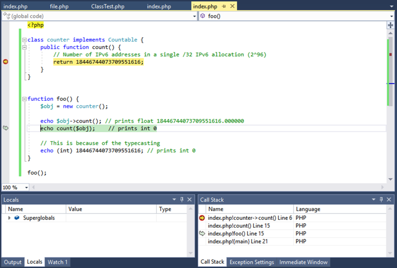

/*
Title: Using Callstack
Description: View the function calls that are currently on the stack
*/

# Call stack

Call stack is very useful when [Inspecting the program state](inspecting-data). You can see the function calls that are currently on the stack, change the context in which you are debugging to another stack frame on the call stack and inspect the program state in the different frames.

The Call Stack window displays the name of each function and the programming language that it is written in (e.g. PHP). The function name may be accompanied by optional information, such as file name or line number. The display of this optional information can be turned on or off.

A yellow arrow identifies the stack frame where the execution pointer is currently located. By default, this is the frame whose information appears in the source, **Locals**, **Watch**, and **Autos** windows. 

> **Note**: Changing the frame will not influence the expression evaluation, which is always evaluated against top stack frame. However, inspecting variable values will work correctly with the selected frame.
