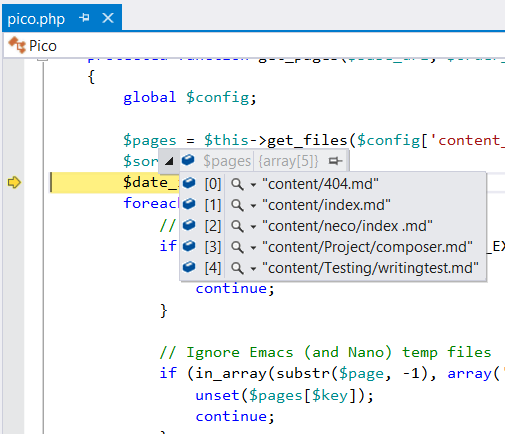

/*
Title: Inspecting Data in the debugger
Description: Inspect variables and evaluate expressions while script is broken in the debugger
*/

# Inspecting Data in the Debugger

While your PHP code is broken in the debugger, you can see the contents of local and global variables using **DataTips**, **Watch** windows or **Immediate** window. You can also change the values of the variables, or evaluate expressions.

## DataTips

To see a value using **DataTip**, simply hover the mouse over any variable in the editor.

> **Note**: **DataTips** are always evaluated in the context where the execution is suspended, and not where the cursor is hovering. If you hover over a variable in another function with the same name as a variable that is in the current context, the value of the variable in the other function is displayed as the value of the variable in the current context.

## Watch Windows

While debugging, you can examine and evaluate variables and expressions using the **Watch** windows. They also allow to expand objects and array to see their members by clicking the `>` expansion indicator.

The **Watch** windows also allow you to edit the value of a variable in the current debugging session. For instructions, see [How to: Edit a Value in a Variable Window](https://msdn.microsoft.com/en-us/library/bhawk8xd.aspx).

You can set the numeric format used in the debugger windows to decimal or hexadecimal by right-clicking on the Watch window and choosing the Hexadecimal Display option from the context menu.

### Locals Window

The **Locals** window (`Debug | Windows | Locals`) contains all variables that are in the current scope.

You will find `Superglobals` object always present in the **Locals** window. This is just a helper that contains all Superglobal variables, which are built-in variables that are always available in all scopes. To read more about superglobals go to [PHP manual](http://php.net/manual/en/language.variables.superglobals.php).

### Autos Window

The **Autos** window (`Debug | Windows | Autos`) displays variables in the current statement and three statements on either side of the current statement.

The current statement is the statement at the current execution location (the statement that will be executed next if the execution continues). The debugger identifies these variables for you automatically, hence the window's name.

### Watch Window

The **Watch** window (`Debug | Windows | Watch | Watch 1-4`) allows you to enter arbitrary PHP expressions and view the results. 

These expressions are reevaluated for each step, unless PHP Tools decides they might cause **side effects**. A **side effect** occurs when evaluating an expression changes the value of data in your application. In this case, the reevaluation of this expression is postponed and only happens when explicitly triggered by user.

> **Note**: Expressions are always evaluated against top stack frame. On the other hand, if you are simply inspecting a variable value, the value is returned from the current frame on the stack. You can always change the current frame in the [Call Stack window](callstack).

### QuickWatch dialog

The **QuickWatch** dialog box lets you examine and evaluate variables and expressions. Because QuickWatch is a modal dialog box, you have to close it before you can continue debugging.

The **QuickWatch** dialog can be useful if you just want to do a quick scratch calculation that involves one or more variables and you do not want to clutter the Watch window with such calculations. For this reason, you can also use the [Immediate Window](#immediate-window).

### String Visualizers

When a value being inspected is a string, you will see a magnifying glass icon on the right side of the value. Clicking on it will display the unquoted string value in a pop-up dialog, with wrapping and scrolling, which is useful for long strings. In addition, clicking on the drop-down arrow on the icon will allow you to select the visualization mode that you want to use: plain text, HTML, XML, and JSON.

In HTML mode, an embedded browser instance will be used to render the HTML code in the string. In XML and JSON modes, there is syntax highlighting for the corresponding markup, and you can expand and collapse individual nodes in the tree.

## Immediate Window

The Immediate window (`Debug | Windows | Immediate`) evaluates entered expressions which are evaluated against the top stack frame and the results are printed.

> **Note**: Changing the current frame in the [Call Stack window](callstack) will only affect simple variable inspections; expressions evaluation will not work.

