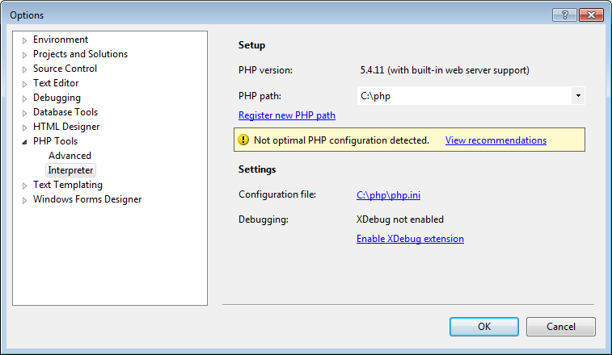

/*
Title: Installing PHP
Description: How to install PHP
*/

# Installing PHP
When running a PHP project locally, it is required to have PHP installed. In order to enable the debugging features, the **Xdebug** PHP extension has to be properly enabled.

## Automatic PHP installation

In case the user does not have PHP with **Xdebug** installed or configured properly, PHP Tools offer quick installation from **Microsoft Web Platform Installer**.

Every time a user starts a project (by default <kbd>F5</kbd> or <kbd>Ctrl+F5</kbd>), PHP Tools automatically checks the configuration. In case of an issue, a quick configuration dialog box will appear (see below).

The first option lets the user install the latest PHP version from **Web Platform Installer** with **Xdebug** support automatically configured. The user may be asked for elevated rights. The process may require to install or update Web Platform Installer first.

During the installation process, a command line may appear. Note that the process may take several minutes, depending on the user's network connection.
 
 

> **Remarks**:
> Automatic PHP installation is not available on **Windows XP** platform.
> User may be asked for elevated rights. In case of insufficient permissions, the process may fail.
> The process requires access to `C:\Program Files\IIS Express\PHP\` folder and its content.

## Manual PHP Configuration

In case the user has configured PHP already, just open **Tools | Options | PHP Tools | Interpreter** to review and access its settings and issues.

 

The user should check whether the correct PHP installation is used, and whether the corresponding configuration file (`php.ini`) is correct. The PHP path option tells Visual Studio what PHP will be used as a default interpreter & runtime. A dialog box allows user to quickly access `php.ini` file and check & fix possible issues.

In case of a configuration issue, the user is notified with a yellow bar and a `View recommendations` button.

 

 

> **Note**: location of `php.ini` is determined in several steps, according to PHP behavior. If the location is not correct, please check the following:
>
> - The system environment variable `PHPRC` forces PHP to use `php.ini` in specified location. Removing this environment variable is recommended.
> - PHP looks for `php.ini` in its directory. Ensure the `php.ini` file exists.
> - PHP specifies several other locations, such as system registry. Follow [http://php.net/manual/en/configuration.file.php](http://php.net/manual/en/configuration.file.php) for more information.