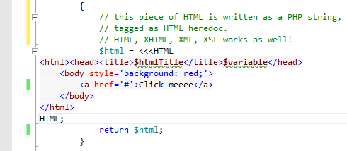

/*
Title: PHP Tools 1.18 News
Description: PHP Tools 1.18 News
Template: blog
Author: Jakub Misek
Date: 2015/09/30
Tags: newsletter, news, html, phpdoc, vs2015
*/

We are happy to announce that the new version of PHP Tools for Visual Studio - 1.18 - is available. The update brings a lot of new features, improvements and fixes

Please visit [downloads page](http://www.devsense.com/download) to download and for more information about the improvements we are introducing. 

## HereDoc & NowDoc

PHP provides programmers with HereDoc (and NowDoc) syntax allowing to specify long pieces of text within the PHP code. The latest version of PHP Tools makes it easier to work with HereDoc by making its content background grey and by allowing to collapse the heredoc block.
Since HereDoc is frequently used for fragments of XML or HTML code, PHP Editor now colorizes XML/HTML within HereDoc.

## New Visual Studio 2015 Editor

Visual Studio 2015 comes with new HTML Editor. The editor fixes a lot of issues. Also there are plenty of plugins extending the new HTML Editor, like new Web Essentials for Visual Studio 2015. Since this update, PHP Editor has been completely rewritten to take advantage of the new HTML Editor allowing a combination of PHP, HTML, JS, CSS and 3rd party plugins within PHP files. This finally fixes a lot of prehistoric issues we've been hearing from our users.
- The context menu finally shows `Peek to Definition`, `Find All References`, `Refactor | Rename` and other entries.
- Outlining of newly opened file does not disappear and then appear.
- Outlining of newly opened file keeps its previously collapsed blocks..
- Highlighting of matching HTML tags does not interact with PHP code.
- Colorization of HTML is not buggy anymore.
- The editor is faster, and allows more extensibility in the future.

Together with this improvement, it is finally possible to change the color of PHP operators in the editor. There is more coming in the future, so stay tuned.

## PHPDoc Improvements

PHPDoc comments get better support in the editor. First of all, class names, variables and tags are colored, which is handy, looks beter and better represents the PHPDoc syntax itself. In addition to colors, we've added full IntelliSense for PHPDoc tags and type parameters. This includes both code completion and tool tips.

## Code Outlining

One of the frequently requested features is the outlining of all code blocks like if, switch, for etc. Since this version, it is possible to enable the outlining for generic code blocks. To do so, go to `Tools | Options | Text Editor | PHP | Advanced` and check `Enable outlining of code blocks`.

## Move Line Up & Down
Visual Studio 2013 introduced shortcuts for moving whole lines up and down using <kbd>Alt+Up</kbd> and <kbd>Alt+Down</kbd>. The feature makes it easier to refactor your code, without the need to cut & paste.
It is even better that the PHP Editor can now format the line according to its new position. The code just fits into its new position and new context as you would cut, paste and format it manually. The functionality has to be enabled in `Tools | Options | Text Editor | PHP | Formatting`, so give it a try!

---

For more information see our [change log](http://www.devsense.com/download) or [features page](http://www.devsense.com/features).