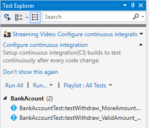
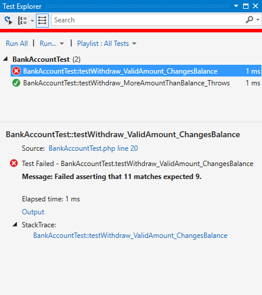
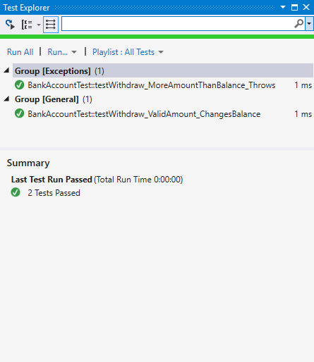
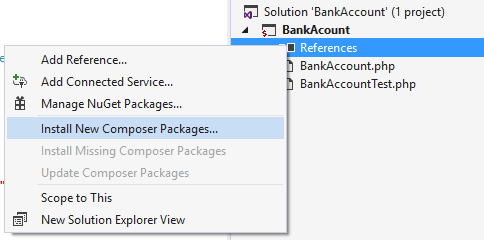

/*
Title: Unit Tests Basics
Description: PHP Tools for Visual Studio, 1.23
Template: blog
Author: Miloslav Beno
Date: 2017/06/22
Tags: PHPUnit, Tests, debugger, phpdoc
*/

## Introduction
	
Testing is essential for verifying that our source code runs as expected. When we are implementing new features or refactoring the old ones, we want to make sure we didn't break any existing functionality. For this purpose, we can take advantage of [PHPUnit](https://phpunit.de) - the most widely used unit testing framework for **PHP** language. 
	
Obviously, **PHPUnit** can be used from the command line, but we can also use it from Visual Studio Testing UI. This dramatically reduces the effort to create and maintain unit tests for new or existing code. In this article, I will demonstrate the basic functionality of unit testing from Visual Studio. This integration works since VS2012 for PHPUnit 5 and 6 (since PHP Tools for Visual Studio 1.24).
	
 To follow this article, you can download and open the sample project.

<a class="btn btn-primary" style="margin-top:10px" href="/content_blog/2017/6/BankAccountSample.zip">
    <i class="fa fa-download"></i>
    Download Sample Project
</a>


## Setting it up
	
To enable testing, we'll need to create a PHP Project. You can either create a new project (`File | New | Project `, select *PHP* and choose *PHP Web Project*) or [create project from existing code](https://docs.devsense.com/project/from-existing-code).
	
**PHP Tools for Visual Studio** comes with build-in **PHPUnit** (since 1.23 it's using version 5.7.9 ). Therefore, we don't need to download **PHPUnit** nor configure it if we don't want to. Later in this article we'll discuss a scenario of what to do when other **PHPUnit** version is required.

## Writing tests

Writing a test for **PHPUnit** requires that the test to fulfills these requirements:

- Files that contain tests have to be suffixed with `Test.php`.
- Test file has to contain class suffixed with the word `test`
- Test class has to be extended from a base test class. Base test class depends on **PHPUnit** framework version, before 6.0 we had to extend from `PHPUnit_Framework_TestCase`, since the new version full class name is `PHPUnit\Framework\TestCase`.
- Test method has to be prefixed with `test`.

These requirements are case-insensitive.

The sample project contains the project `BankAccount` with two files: `BankAccount.php` and `BankAccoutTest.php`. 

`BankAccount.php` contains a simple object which represents the bank account of a customer with two methods, one to deposit funds and the other to withdraw funds. There is an intentional bug in this method, so we can demonstrate how it looks like when the test will fail.

```php

<?php

/**
 * Bank Account demo class.
 *
 */
class BankAccount
{
    var $customerName;
    var $balance;
    var $frozen;


    function __construct($customerName, $balance)
    {
        $this->customerName = $customerName;
        $this->balance = $balance;
    }

    public function Withdraw($amount)
    {
        if ($this->frozen)
        {
            throw new InvalidArgumentException("Account frozen");
        }

        if ($amount > $this->balance)
        {
            throw new InvalidArgumentException("Amount has to be less or equal to $this->balance");
        }

        if ($amount < 0)
        {
            throw new InvalidArgumentException("Amount has to be greater or equal to 0.");
        }

        $this->balance += $amount; // intentionally incorrect code
    }

    public function Deposit($amount)
    {
        if ($this->frozen)
        {
            throw new InvalidArgumentException("Account frozen");
        }

        if ($amount < 0)
        {
            throw new InvalidArgumentException("Amount has to be greater or equal to 0.");
        }

        $this->balance += $amount;
    }

    private function FreezeAccount()
    {
        $this->frozen = true;
    }

    private function UnfreezeAccount()
    {
        $this->frozen = false;
    }

}

```

The other file contains a test for `BankAccount` class. To test the `BankAccount.Withdraw` method we can write two tests. One that verifies the standard behavior of the method and one that verifies that a withdrawal of more funds than what the accout's balance has will fail.

```php

<?php

require "BankAccount.php";


class BankAccountTest extends PHPUnit\Framework\TestCase
{
    /**
     * @var BankAccount
     */
    protected $account;

    function setUp(){
        $this->account =  new BankAccount("John", 10);
    }

    /**
     * @group General
     */
    function testWithdraw_ValidAmount_ChangesBalance()
    {
        $withdrawal = 1;
        $expected = 9;

        $this->account->Withdraw($withdrawal);
        self::assertEquals($expected, $this->account->balance);
    }

    /**
     * @expectedException InvalidArgumentException
     * @group Exceptions
     */
    function testWithdraw_MoreAmountThanBalance_Throws()
    {
        $this->account->Withdraw(20);
       
    }
}

```

`testWithdraw_ValidAmount_ChangesBalance` uses `assertEquals` static method to determine whether the test method will pass or fail.

> **Note**: We're not sure why all the available examples for **PHPUnit** use `$this->assertEquals` when this method is static! PHP will run it, but why? Please write in the comments section if you know the answer.

While `Withdraw_ValidAmount_ChangesBalance` uses an explicit assert statement, `testWithdraw_MoreAmountThanBalance_Throws` contains **PHPDoc** comment with `@expectedException` tag to determine the success of the test method. In this case if the exception is thrown in the method the test will pass, otherwise it fails.

## Run/Debug Tests in Test Explorer

When the tests fulfill all the requirements mentioned in previous section, they are shown in the **Test Explorer**. To display the **Test Explorer**, choose **Test** on the Visual Studio menu, choose **Windows**, and then choose **Test Explorer**.



Click **Run All** to run all our tests, or select some of the tests, right click on the selection and choose **Run Selected Tests**.


When the tests are finished, the **Test Explorer** displays the results of the tests in groups of **Failed Tests**, **Passed Tests**, **Skipped Tests** and **Not Run Tests**. We can select any of the groups and run just these tests e.g. tests that failed previously. So, we can save time runing tests that we know have passed. 

In the case of our sample, one test has passed and the other has failed. Also, we can see the amount of time the test run has taken. When we click on the test, we can examine the stacktrace and an assertion message in bottom of the **Test Explorer**.



To find out why it has failed, we can use a debug feature. Put a breakpoint to the failed test, then in the **Text Explorer** select the test you want to debug and right click to see the context menu, choose **Debug Selected Tests**.


The debug session will start and we will be able to use VS debug capabilities: step, inspect variables, evaluate expressions etc. In order to see why our test is failing we can step inside (<kbd>F11</kbd>) the `Withdrawal` method.


The code is obviously incorrect. We can stop the test by pressing <kbd>Shift + F5</kbd> or just finish the session by <kbd>F5</kbd>. Let's change `+=` operator to `-=` and run the test again.


Now, all tests have passed.

## Filter and Group the Test List

In case we have a large number of tests, we can filter tests by matching text in the search box on global level or by selecting one of the pre-defined filters. We can also group tests by category by choosing the `Group By` button. Tests can be grouped by Class, Duration, Outcome, Project and Traits. When choosing Traits, we can group tests by our categories added by phpdoc tag @group and the name of the group. We can also use shortcut tags @small @medium @large, which also sets timeout for the test, small 1sec, medium 10 sec, large 60sec. For more information check out annotations on phpunit site https://phpunit.de/manual/current/en/appendixes.annotations.html



On the picture above, there are two custom groups defined in the test, Exceptions and General.

## Custom PHPUnit

**PHP Tools for Visual Studio** comes with build-in **PHPUnit** in case you don't want to hassle with installing and configuring it. However, in many cases we will need to use a specific version or a modified version of PHPUnit. That can be easily done e.g. through **Composer**. If **PHPUnit** is installed through **Composer**, PHP Tools will recognize it and use it for running the tests.

To install a **PHPUnit** composer package we can right click to the **References** node in the **Solution Explorer**, choose **Install New Composer Package...**.



In the search box, enter `phpunit`, in the options select **Development** as **Dependency Type** and hit **Install Package**. We can close the dialog box, the package will install in the background. Once this is done, which we can see in the **Status bar**, we can run all tests again.


In the **Output pane** (`View | Output Pane`) we can see what **PHPUnit** version was used. In this instance we've installed 6.2.2 which is the latest in the time of writing this article.


## Conclusion

In this article, I've shown some basic functionality of PHP unit testing in Visual Studio. I hope that it will help you next time you want to test something.
