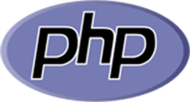
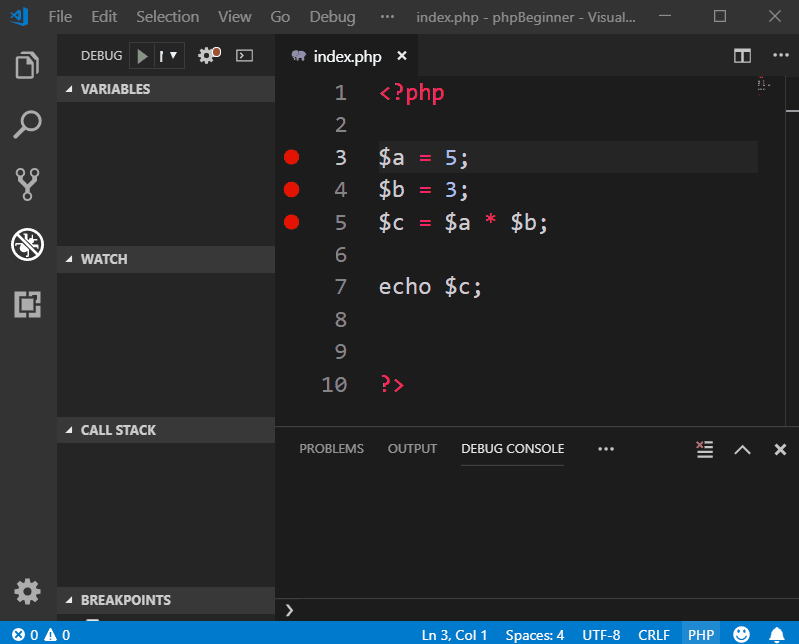

/*
Title: 12 Reasons You Should Learn PHP in 2019
Description: 12 Reasons You Should Learn PHP in 2019
Template: blog
Author: DEVSENSE
Date: 2019/01/24
Tags: PHP
*/

Did you know that PHP is used by more than 80% of all the websites? Over the last quarter of century, a lot of programming languages were claimed to be the best, but only PHP became a worldwide language and steadily stayed among the top most used programming languages. 

You might ask: if there are several programming languages, why should I choose PHP? In this article, you will find the most important reasons to choose and use PHP as a programming language. 

## Just so that you know:

`Front-end:` When you use your computer, tablet or smartphone, the front-end is all you see and touch. Users interact with front-end applications directly. For front-end purposes, HTML, CSS, and JavaScript are used. 

`Back-end:` There is always some software running behind the scene which users don't know about. This kind of software is called "back-end". The mission of this back-end software is to respond to any of the users requests. Back-end software is developed by server-side languages like [PHP](https://secure.php.net/), [Node.js](https://nodejs.org), [Python](https://www.python.org/), [Ruby](https://www.ruby-lang.org), etc.

PHP is an open-source server-side programming language. It was created in 1994 by [Rasmus Lerdorf](http://lerdorf.com/bio/). Originally, PHP was a simple set of scripts. Lerdorf used these scripts for tracking visits to his online resume and he named them "Personal Home Page". Over time, he rewrote PHP and added more functionality.

In June of 1995, Lerdorf released the source code for PHP to the public, which allowed developers to use it and he encouraged them to improve PHP to fit their needs. In 1997, he and his colleagues used the word "PHP" as a recursive acronym which stands for "PHP: Hypertext Preprocessor". In 1998, PHP already had several thousand users around the world. Since then, PHP became a legend.  

The Elroubio Movie - PHP to elePHPant

## Why should you learn and use PHP?

There are many reasons to develop server-side software using PHP. The most important are: 

### 1. PHP is open-source and free

PHP is an open-source programming language. This means it's free. There are no open or hidden license fees, so it makes it very useful for popular Content Management Systems (CMS), like [Wordpress](https://wordpress.com). 

Since it is open-source, it's available for all developers, especially new ones which will develop and carry PHP to the future. Also, it is cheaper and easier for them to create a website using PHP. You can download PHP from [here](https://secure.php.net/downloads.php), but if you're not sure of what version you should download and how to configure it, PHP Tools for Visual Studio will do it for you in a [simple step](https://docs.devsense.com/en/vs/installation/install-php). 

### 2. PHP is easy to learn

PHP offers many advanced features for a professional programmer, but at the same time, it is extremely simple for a newcomer. In a short time, anyone can start writing simple scripts. PHP's major aim was to be friendly and easy for novices to create simple personal pages. Because writing a PHP script is simple, it became - and it still is - a popular language for beginners.  

### 3. PHP is fast

Today, there are millions of internet users and every second they require something from the web servers. Especially for critical web applications like banking, security and governmental applications, speed is crucial. So, the servers and the programming language on the servers have to be really fast. With the release of PHP 7.x, PHP became 3 times faster than before. The table below compares PHP with other back-end languages.

<table class="table table-bordered table-hover">
	<thead>
		<th></th>
		<th>Test 1</th>
		<th>Test 2</th>
		<th>Test 3</th>
		<th>Test 4</th>
	</thead>
	<tbody>
		<tr>
			<td>PHP</td>
			<td>2.61</td>
			<td>41.29</td>
			<td>12.54</td>
			<td>0.47</td>
		</tr>
		<tr>
			<td>Node.js</td>
			<td>11.98</td>
			<td>64.78</td>
			<td>16.41</td>
			<td>N/A</td>
		</tr>
		<tr>
			<td>Python 3</td>
			<td>16.98</td>
			<td>72.80</td>
			<td>16.03</td>
			<td>3.47</td>
		</tr>
		<tr>
			<td>Ruby</td>
			<td>23.58</td>
			<td>189.81</td>
			<td>23.09</td>
			<td>3.42</td>
		</tr>
		<tr>
			<td colspan="5">Results are in seconds. (Smaller is better)</td>
		</tr>
		<tr>
			<td colspan="5">Source: <a href="https://benchmarksgame-team.pages.debian.net/benchmarksgame/faster/php.html" target="_blank">"The Computer Language Benchmarks Game"</a></td>
		</tr>
	</tbody>
</table>

### 4. PHP is well documented

It is important that a programming language has enough documentation for the developers to learn and understand the language usage. PHP has very good [online documentation](https://secure.php.net/docs.php) with a good framework of functions. There are lots of forums and dozens of tutorial websites about PHP. So, it is very easy to get help when needed. For beginners, W3Schools.com has [a very good PHP tutorial with lots of examples](https://www.w3schools.com/php/default.asp).

### 5. PHP has a huge library

A software library is an online place where data and programming code are stored ready to develop programs and applications. It assists the programmer in building and executing software. 

PHP has an enormous library which makes development much easier. The PHP packages repository, called [Packagist](https://packagist.org/), is a strong backbone holding PHP. There are thousands of ready-to-use PHP libraries available which are inter-compatible among themselves all the time. You can read more about libraries [here](https://www.techopedia.com/definition/3828/software-library). 

### 6. PHP users can rely on their community support

Although developers have large libraries and lots of documentation, sometimes they won't find what they're looking for and need to get help from other developers. A large community is essential for this purpose. The PHP community is the largest of all technologies, consisting of experienced developers helping and supporting each other. You can find a collection of the best blogs and websites by following [this link](https://blog.feedspot.com/php_blogs/). 

### 7. PHP has well-designed frameworks 

If you want to develop an application which is really fast, very secure and has strong foundations, you'll need to spend months to complete your application. However, if you use some scripts which are already written and tested, it'll take minutes to develop a simple application. These set of scripts are called [Frameworks](https://www.quora.com/What-is-a-framework-in-programming). They are the scaffold of applications, so you'll only need to fill in the blanks.  

In order to develop competent applications, it's generally better to use a well-designed framework. PHP offers easy-to-use, fast and secure frameworks. Some of the PHP frameworks are [Laravel](https://laravel.com/), [Symfony](https://symfony.com/), [Yii](https://www.yiiframework.com/), [Phalcon](https://phalconphp.com), [FuelPHP](https://www.fuelphp.com/), [Zend Framework](https://framework.zend.com/), [PHPixie](https://phpixie.com/), and [CakePHP](https://cakephp.org/). 

### 8. Debugging is simple with PHP

Almost all developers make some small mistakes during the development phase of their application. These small mistakes are called bugs. 

There are two ways to find the bugs and correct them. The first way is to read all of your code from the beginning to the end. A code can be hundreds, thousands of lines, or even millions, depending on the type of application or service, so, this way is very time-consuming and inefficient. The second way -and the favorite for developers- is to use the debugger. 

A debugger is a list of tools to help you to find the bug. So, it's expected that for any language there should be effective debugging tools. PHP provides the [XDebug](https://xdebug.org/) extension to assist with [debugging](https://www.techopedia.com/definition/16373/debugging) and development. 

An example of adding Breakpoints in Debugging using [PHP Tools for Visual Studio](https://www.devsense.com/en/features)

### 9. PHP has support for most of web servers

[Web hosting](https://www.website.com/beginnerguide/webhosting/6/1/what-is-web-hosting) is a service that allows anyone to post websites to the Internet. A web host provides the hosting service and makes the websites so that they can be viewed on the Internet. Websites are hosted or stored on special computers called servers. 

So, if you want to store your web application to a web server, you must be sure that the web server has support for your programming language. PHP has support for almost all of the web servers today. 

### 10. PHP can be used on different operating systems

PHP is used on almost all operating systems, including Linux and other Unix variants, Microsoft Windows, macOS, RISC OS, etc. With PHP, you have the flexibility to choose your web server and the operating system. 

### 11. You can choose between PP and OOP with PHP

Programs are made up of parts that can be written separately and then assembled to form a complete program. In procedural languages (PP), these parts are called procedures. The difficulty with this type of programming is that software maintenance can be difficult and time-consuming.  

In object-oriented programming (OOP), the main modules in a program are classes, so you can create classes and objects similar to real-world objects. You can read more here: [Difference Between Object-oriented Programming and Procedural Programming Languages](https://neonbrand.com/website-design/procedural-programming-vs-object-oriented-programming-a-review/). 

With PHP, you have the choice of using procedural programming, object-oriented programming, or both of them.

### 12. PHP has support for many databases

The files in which we store data are called databases. If you need to use a database in your application, the programming language that you use must have support for that kind of database. PHP supports a [wide range of databases](https://secure.php.net/manual/en/refs.database.php). With PHP, using database connections is super easy. 

PHP is a legend and there are still millions of users of it. The biggest online brands, such as [Facebook](https://www.facebook.com/), [Digg](http://digg.com/), [ProProfs](https://www.proprofs.com/), [Yahoo](https://www.yahoo.com/), and [Flickr](https://www.flickr.com/) are powered by PHP. It is a smart choice to learn PHP and start developing powerful web applications. 

Long live PHP! 