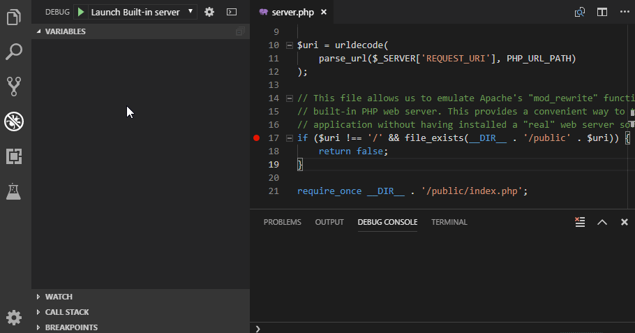

/*
Title: 6 core factors to consider when choosing a PHP developing tool
Description: 6 factors to consider when choosing a PHP developing tool
Template: blog
Author: DEVSENSE
Date: 2019/03/18
Tags: PHP
*/

Choosing the right developing tool for PHP could be key to your software development. Just think about it- you will be investing a huge amount of time inside it. A useful IDE (integrated development environment) can help you speed up your PHP programming and be more productive. It means less typing and potentially learning something, if you’re new to programming.

However, an IDE that is slow and or one that doesn’t handle the issues you need will kill your productivity. Anything that slows you down will quickly become a larger problem over time. That’s why developers should consider different factors when deciding which is the most convenient tool for their development. In this article, we list 6 core factors to help you choose your development tool for PHP.

## 1) Features

One of the most important factors when deciding what’s the correct tool for PHP is its features. Most IDEs will offer syntax highlighting, spell-checking and auto-completion. Check what other features it has to offer and how they will adapt to your needs and to the overall completion of the project. Does it provide navigation and code refactoring? Does it include a debugger? These features could be crucial to your development.

## 2) Speed

Isn’t it frustrating when you type something and the software takes forever to respond? Well, now imagine this over and over, all day long, every day. Any time that you could have saved with the tool, now it’s gone because of a slow-responsive IDE. That’s why you need your IDE to be fast. It will not only increase your productivity, it will *really* save you time, and even consume less battery!

## 3) Easiness to use

Any software has its own learning curve, to one degree or to another. However, complex tools require more effort and time to be used efficiently. And who wants to spend more time learning about the IDE, reading its documention, or asking for help, than actually working on it? So, easiness to use must be also taken into account when choosing your PHP developing tool. You should be able to know the capabilities and learn to use your IDE fast and efficiently. That involves becoming familiar with the key-shortcuts or the most commonly used commands. The easier that it is for you to know the capabilities, the faster you will start to improve your productivity.

## 4)	Compatibility with your environment

Make sure that the tool you choose works for your environment. Not all IDEs that work for Windows will for for macOS or for Linux. Basic stuff, but you’ll be amazed by the amount of people that forget to check this beforehand. 

## 5) Support

Another essential factor when choosing your IDE for PHP. Fixing bugs, improving already existing functionalities, removing useless or unwanted features, improving software performance- you name it! Support is vital. You need your PHP IDE to be constantly checked and updated with the latest technologies for it to run seamlessly and with high-end efficiency. 

## 6) Integration capability

This means just how well the IDE integrates other tools – the more tools you can integrate seamlessly, the more productive you’ll be. The IDE you choose must be able to suppport major frameworks for PHP, and it not only needs to integrate other tools with features not already covered, but also allow easy access to them. It's essencial that the integration is seamless, because nobody wants to leave their IDE to perform other tasks outside!

### Conclusion

Selecting a developing tool for PHP can be a critical step for your project. These are just some of the most important factors that should be taken into account when evaluating the overall value of the tool. 
Since there are plenty of options and a variety of different IDEs available, you should always try them and see if they adapt to your specific needs.

