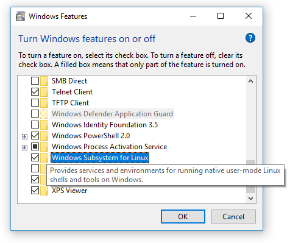
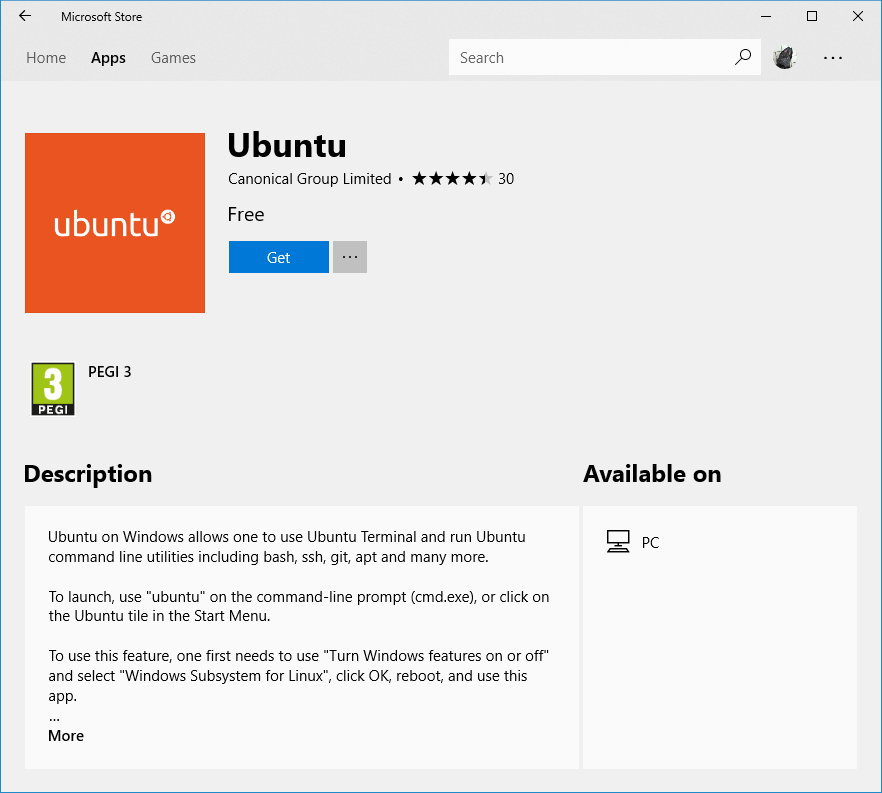
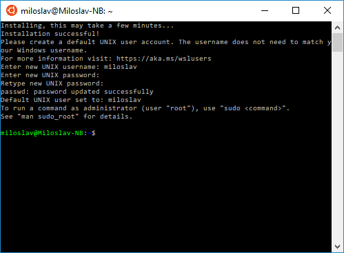
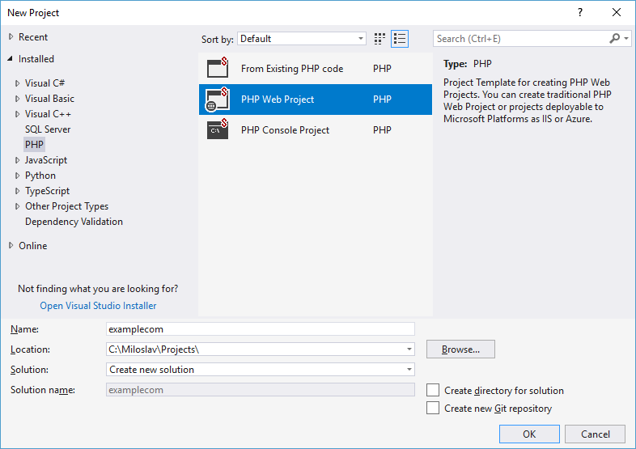
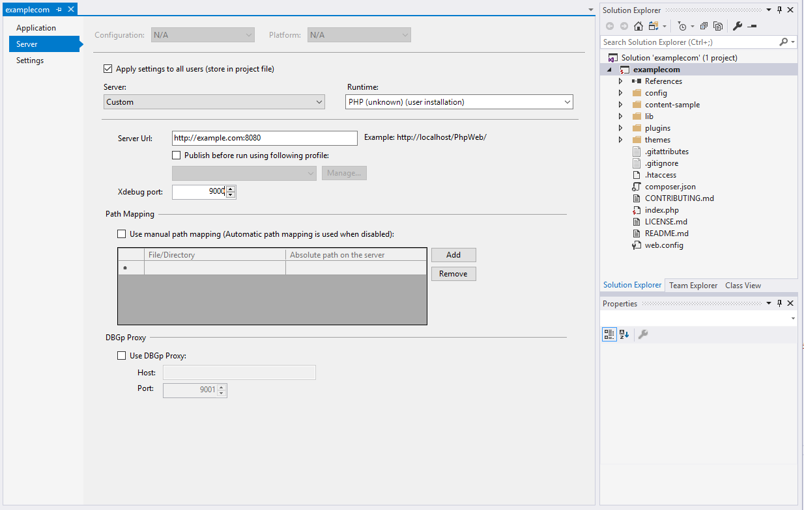

/*
Title: How to setup Windows Subsystem for Linux for a PHP Development on Visual Studio
Description: How to setup Windows Subsystem for Linux for a PHP Development on Visual Studio
Template: blog
Author: Miloslav Beňo
Date: 2018/04/24
Tags: WSL, PHP, Ubuntu, Apache, Xdebug
*/

I was sitting in the coffe shop and my laptop was going quite loud. I opened Task Manager to check what was eating my CPU. Ok, the virtual machine is going crazy again.

To save up CPU resources and disc space, because I never have too much disc space, I decided to get rid of my linux virtual machines and use this thing called [Windows Subsystem for Linux](https://docs.microsoft.com/en-us/windows/wsl/about). It allows to run a Linux environment including most of the Linux applications without the need to actually have a Linux kernel. It just needs **Windows 10** which I already have.

Since I just need Linux to test some **PHP** projects and I don't need isolation of virtual machine or possibility to revert, I will be fine with just **WSL** without an overhead of virtual machine.

Now, I will demonstrate how you can set it up.

## Install WSL

1. First you will need to install the **Windows Subsystem for Linux**. Open up Control Panel and turn it on as a feature.

 

2. Restart yout computer if needed

## Install Linux

1. You can go ahead, open Microsoft Store and install **Ubuntu**. **WSL** doesn't limit you to just this Linux distribution, so you are free to choose your favorite one.

 Here are the direct links to some of them:
  - [Ubuntu](https://www.microsoft.com/store/p/ubuntu/9nblggh4msv6)
  - [OpenSUSE](https://www.microsoft.com/store/apps/9njvjts82tjx)
  - [Debian](https://www.microsoft.com/store/apps/9MSVKQC78PK6)
 
 In time of the writing I haven't found **Red Hat** or **Fedora**.

 

2. Click **Get**. After the installation you should see **Ubuntu** bash.

 

## Install Apache and PHP

1. Once you've installed **Ubuntu**, you will need to get a web server and **PHP**. I'm going to install **Apache** in the article, but feel free to install the web server of your preferences.
 
 ```bash
 sudo apt-get update
 sudo apt-get install apache2
 sudo apt-get install php
 sudo apt-get install libapache2-mod-php7.0
 ```
 
2. Get **Xdebug**
 
 ```bash
 sudo apt-get install php-xdebug
 ```
 
3. Turn **Xdebug** on. Open `php.ini`.
 
 ```bash
 sudo nano /etc/php/7.0/apache2/php.ini
 ```
 
 Append these lines to the end of the file:
 
 ```
 [Xdebug]
 zend_extension=xdebug.so
 xdebug.remote_enable=1
 xdebug.remote_host=localhost
 xdebug.remote_port=9000
 ```

## Create a PHP project

1. If you happen to have **PHP Tools for Visual Studio** version `1.27 or higher` you can use the **New project** dialog.

 Just click `File | New | Project`, select **PHP Web Project**. Fill the location and the name.

 

2. Select **Simple CMS Project**, just to try out something a little more complex than the "Hello World" script.

 

 3. If you don't have any **PHP** installation on **Windows**, **PHP Tools** will ask you if you'd like to install it, you can just click **Yes**.

 Then you will get asked if you wish to download composer packages. Click **Yes**.

## Create a site on Apache

1. Once you have a project, you need to decide how to get it to the Ubuntu. The traditional way would be to publish it (and all the subsequent changes) through FTP/S or share it through Samba. Luckily **WSL** automatically mounts Windows filesystem so you can access it from **Ubuntu**. For c drive it's `/mnt/c`. For developing purposes, you can setup **Apache** to serve files directly from there.

 > **Note:** You can also access Linux files from **Windows**, but use it just as read-only view. Altering files will possibly lead to data corruption. You can find **Ubuntu** files on this location: `%localappdata%\Packages\CanonicalGroupLimited.UbuntuonWindows_79rhkp1fndgsc\LocalState\rootfs\` .

2. Create a site on **Apache**.

 ```bash
 sudo cp /etc/apache2/sites-available/000-default.conf /etc/apache2/sites-available/example.com.conf
 sudo nano /etc/apache2/sites-available/example.com.conf
 ```

3. The newly created file will look something like this (I've removed the comments so it's shorter):

 ```
 <VirtualHost *:80>
  ServerAdmin webmaster@localhost
  DocumentRoot /var/www/html
  ErrorLog ${APACHE_LOG_DIR}/error.log
  CustomLog ${APACHE_LOG_DIR}/access.log combined
 </VirtualHost>
 ```

4. For our example I've chosen the site name example.com, so change the configuration file to:
 
 ```
 <VirtualHost *:8080>
  ServerAdmin admin@example.com
  ServerName example.com
  ServerAlias www.example.com
  DocumentRoot /mnt/c/Miloslav/Projects/examplecom
  ErrorLog ${APACHE_LOG_DIR}/error.log
  CustomLog ${APACHE_LOG_DIR}/access.log combined
 </VirtualHost>
 ```
 
5. To be able to access `example.com:8080` from **Windows** you have to modify the hosts file located at `C:\Windows\System32\drivers\etc\hosts`. Append the following line to the end of a file.

 ```
 192.168.1.137 example.com
 ```

## Set up Apache

1. If you do have a web server on **Windows** listening on port `80`, you will need to change the default port from `80` to something else, e.g. `8080`. Rewrite it in the `ports.conf` file:
 
 ```bash
 sudo nano /etc/apache2/ports.conf
 ```

2. Give **Apache** permissions to access your project files
 
 ```bash
 sudo nano /etc/apache2/apache2.conf
 ```

3. Add this snippet to the configuration file. Change `/mnt/c/Miloslav/Projects` to location where you have your projects.
 
 ```
 <Directory /mnt/c/Miloslav/Projects>
  Options Indexes FollowSymLinks
 AllowOverride None
 Require all granted
 </Directory>
 ```

4. Change permissions on filesystem
 
 ```bash
 sudo chmod -R 755 /mnt/c/Miloslav/Projects
 ```
 
5. Restart **Apache**
 
 ```bash
 sudo /etc/init.d/apache2 restart
 ```

## Before you run it
 
1. Before you run the website you'll need more PHP extensions in Linux. For our **Simple CMS Project** template, which is just slightly modified Pico CMS, you will need to install the following extensions.
 
 ```bash
 Sudo apt-get install php-xml
 Sudo apt-get install php-mbstring
 ```

2. In **Visual Studio** your PHP Web Project has to be instructed about the web server setting in **Ubuntu**. Just right click on project node in the **Solution Explorer**, click **Properties**.

 

## It's done

That's it. Now you can develop a PHP project in **Visual Studio** and run it on **Apache** on **Ubuntu** using **Windows Subsystem for Linux**. Let us know in the comments bellow if this tutorial helped or if there is any other other topic you would like us to see cover.