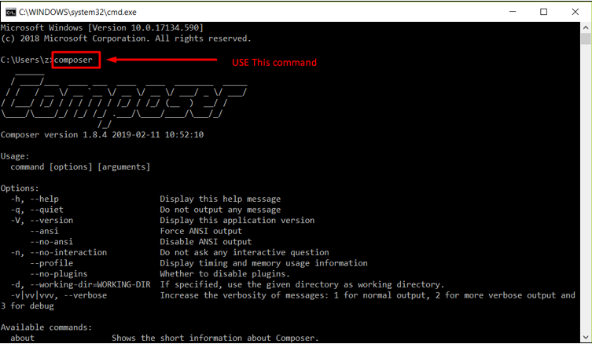
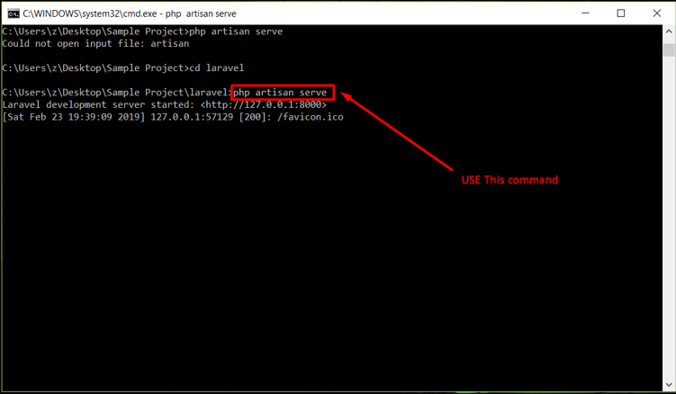
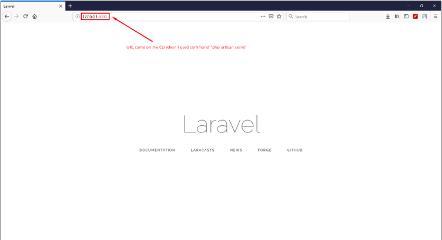
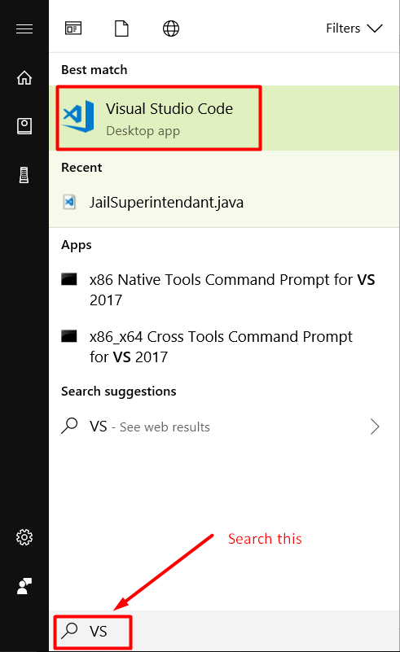
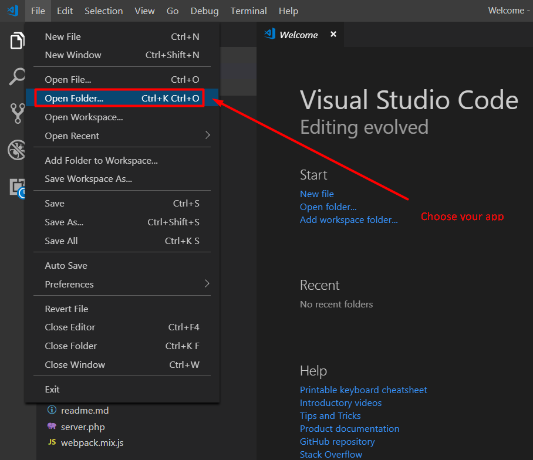
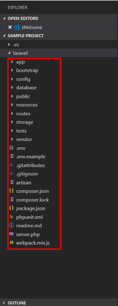
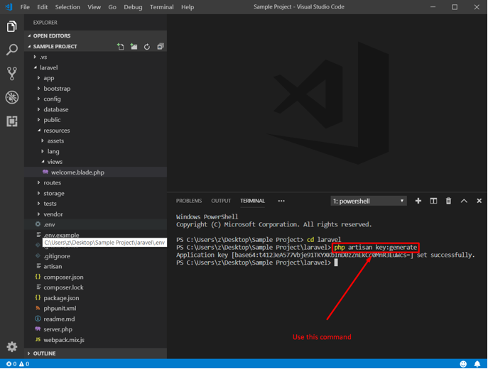

/*
Title: How to install Laravel for Visual Studio Code
Description: How to install Laravel for Visual Studio Code
Template: blog
Author: DEVSENSE
Date: 2019/03/01
Tags: PHP
*/

[Laravel](https://laravel.com/) is a well-respected and [popular PHP framework](https://blog.devsense.com/en/2019/02/symfony-vs-laravel). As you might have read before, it aims to facilitate many of the common tasks of the majority of projects, while also strengthening security and database migration. That’s why many developers are convinced that Laravel provides one of the most reliable and efficient approaches to building a website. In this tutorial, you will learn how to install Laravel for Visual Studio Code from scratch. 

## Installation

### 1) Install Visual Studio Code.

You can download Visual Studio Code (VS Code) directly from its [download page](https://code.visualstudio.com/download). For a detailed setup guide, click [here](https://code.visualstudio.com/docs/setup/windows). If you have it already installed, you can just ignore this step. If your using Visual Studio (instead of VS Code), [PHP Tools](https://www.devsense.com) will do this step for you. 

### 2) Install Composer

Before you install Laravel, you need to get Composer. Composer is a tool that helps with dependency management in PHP. It allows installing and updating different components for the framework and it manages all libraries and dependencies in one place. So, in order to work on Laravel, it is necessary to have Composer already on your system. You can download it from this page: [https://getcomposer.org/download/](https://getcomposer.org/download/)


You can check whether Composer was installed by typing the word “composer” on the command prompt. You should see something like this: 



### 3) Create a directory for your project.

Now, you need to create a directory for your new Laravel project. This step might take some time, depending on the speed of your internet. You can create a directory anywhere in your system and then use the command prompt to go to that directory with the following command: 

```
composer create-project laravel/laravel ProjectName 
```


### 4) Start Laravel

Laravel comes with [Artisan](https://laravel.com/docs/5.0/artisan). Artisan is a command-line interface (CLI) and one of the most important components of Laravel. When you downloaded the framework from the server on step 3, Laravel’s Artisan CLI was installed automatically. You don’t need to install it separately.

Artisan is a very helpful tool: it provides a series of commands that will assist you in developing your app. Basically, it minimizes the creation of manual tasks, because each command will create them for you. Just by running a command, you can create controllers and modes, database migration files (and then run those migration files), providers, events, jobs, form requests, session commands, and your own custom commands. Artisan will also show the available routes, run [Tinker](https://laravel-news.com/laravel-tinker) (a tool to interact with the database), and more. 

To start Laravel, run this command: 

```
php artisan serve 
```

You should see a screen with the following line: `Laravel development started on` plus a URL. 



### 5) Open the URL on your browser. 

Copy the URL from the previous step and open it on your browser. The following image is what you should see when Laravel has been installed successfully. 



### 6) Open Laravel on Visual Studio Code 

In order to open Laravel and start building your app, you need `Visual Studio Code`. Just follow these simple steps: 

 - Search for `Visual Studio Code` in the start menu. 

 

 - Open `Visual Studio Code`. 

 - Click `File` on the Menu bar and choose `Open Folder`

 - Open Laravel by choosing the folder that you created on Step 3. 

 

 - After opening Laravel, you should see the following folders and files:  

 

## Configuration

After you have successfully installed Laravel on Visual Studio Code, everything should work just fine. However, there’s a configuration option that you always need to set- your unique application key.

In order to have your own unique application key, you need to run the command below on the command prompt (before executing this command, make sure you’re in the root directory of the Laravel application): 



As you can see on the above picture, after you run the command for generating your key, there’s a line that tells you that the application key has been set successfully. Save the file and you should be ready to start building your new app. For a more detailed explanation of other Laravel configurations, click [here](https://laravel.com/docs/5.7/configuration). 

In this tutorial, we have learned how to install Laravel for Visual Studio Code. Laravel will help you build more efficient and reliable sites. You’ll see that once you get to know it and have worked with it for a while, Laravel makes PHP fun. It’s a framework that will definitely stick around for the years to come. 

You might also want to read:

 - [Symfony vs. Laravel](https://blog.devsense.com/2019/02/symfony-vs-laravel)

 - [12 reasons you should learn PHP in 2019](https://blog.devsense.com/2019/01/why-php)

 - [Top PHP Interview Questions in 2019](https://blog.devsense.com/2019/01/php-interview-questions-2019)
