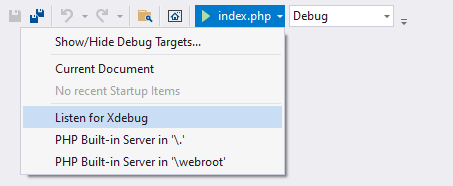

/*
Title: March 2022 (1.62)
Tags: release notes,visual studio
Date: 2022-03-01
*/

# March 2022 (version 1.62)

**Downloads:** https://www.devsense.com/download<br/>
**Purchase:** https://www.devsense.com/purchase

Welcome to the March 2022 release of PHP Tools for Visual Studio.

## Editor

### Adding `use` is Sorted

The editor inserts `use` statements for you; either from a code action over a class name, or when completing a class that is not imported in the current file yet.


Newly, whenever the new `use` is inserted by the editor - either as an auto-import by code completion or from a code action - the editor inserts it within the existing `use`s block in the order, sorted alphabetically.

This behavior even respects `function` and `const` aliases by grouping them together.

### Laravel Facades

Laravel framework is known for it's use features like _Service Containers_, use of class aliases, and _Facades_. This allows for seamless dependency injection and basically shorter code you have to write.

```php
// Cache is a facade to the 'cache' service ...
return Cache::get('key');
```

Newly, the editor is recognizing built-in and your custom facades, it recognizes the facade accessor service, it recognizes defined services as well. Also, the editor scans the workspace for laravel class aliases defined in `config/app.php` file.


Here, the editor knows that the class `\Auth` is actually an alias to a class `\Illuminate\Support\Facades\Auth`, which is a facade to a service `auth`, which is an instance of class `AuthManager` .. in the result, it is able to provide code completion and full IntelliSense here.


---

> Note, the editor simultaneously supports the `@mixin` and the `@method` PHPDoc tags, in case the provided facades support is not sufficient.

### IntelliSense

IntelliSense has been greatly improved and the integrated multilanguage manual updated. The code analysis now takes ORM attributes into account, and type information from PHPDoc is combined with the type hints. This improves the overall code completions and code analysis.


The image above depicts how IntelliSense respects the ORM notation. It infers the property type automatically, and provides the corresponding code completion.

## Workspace

We have added more debugging options for the Visual Studio's _Open Folder_ features. Without creating regular project in Visual Studio, it is possible to simply open a folder, and get most of the features for the PHP development now.

IntelliSense, debugging, and Test Explorer are fully supported in folder workspaces now.



By default, there are launch options to

- Listen for Xdebug
- Start and Debug built-in web server
- Start and Debug current .php document as a CLI script.

All these launch options are configurable through Visual Studio's launch settings.

---

> Note: for the full-featured fully configurable PHP development, it is recommended to [create a project](https://docs.devsense.com/en/vs/project/new-project).

## Fixes

- stability fix for too large solutions (`StackOverflowException`)
- some PHAR files were not visible in IntelliSense, fixed
- fixes smart indentation after PHP 8 attributes `#[]`
- debugger stability fixes
- debugger shows stack traces of unhandled exceptions
- IntelliSense respects PHPDoc that are followed with PHP 8 attributes

## Improvements

- more details in the built-in PHP manual
- updated built-in PHP manual
- updated translations of the built-in PHP manual
- generated PHPDoc for properties respect its type hint
- IntelliSense and code analysis combines PHPDoc types and type-hint information
- more detailed IntelliSense for deprecated functions and classes
- IntelliSense and tool-tips show the correct version of `implode` function
