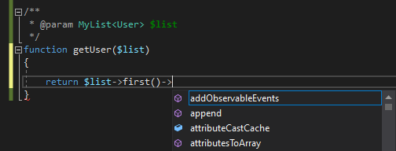

/*
Title: April 2022 (1.64)
Tags: release notes,visual studio
Date: 2022-04-19
*/

# April 2022 (version 1.64)

**Downloads:** https://www.devsense.com/download<br/>
**Purchase:** https://www.devsense.com/purchase

Welcome to the April 2022 release of PHP Tools for Visual Studio.

## Generic Types

Even though PHP language does not have generic types yet, it is a good practice to annotate the code with documentary comments with template arguments. For example, the Laravel 9 takes huge advantage of the Psalm/PHPStan annotations, including the generic `@template`s annotation.

With this release of PHP Tools, the syntax for generics is fully supported, generic types and inferred generic types are shown in corresponding tool-tips, code completion uses the inferred types, and more. This greatly improves eventual code completion and code refactoring wherever the generic types are either specified or inferred by the editor.

### Generic PHPDoc Syntax

There are several documentary tags and keywords providing additional type information. Since this release of PHP Tools, the additional tag and keywords are recognized. This includes the following tags:

- `@template` annotates a class/interface/trait or a function generic argument.
- `@extends` allows to specify generic types for a base class.
- `@implements` specifies generic types for base interfaces.
- `@use` specifies generic types for the used trait.
- and the corresponding variations prefixed with `@psalm-` or `@phpstan-`, which basically means the same.

The usage, which can be for example seen across Laravel 9, would look like the following:

```php
/**
 * @template T
 */
class MyList
{
    /**
     * @param array<T> $values
     */
    function __construct($values) {...}

    /**
     * @return T
     */
    function first() {...}
}
```

In order to use the generic types, it is possible to annotate PHPDoc type hints with the generic syntax using `<` and `>` characters. In case there are more template arguments, they are separated with comma (`,`), e.g.

```php
/**
 * @param Collection<int, object> $parameter1 The collection of objects, indexed by a number.
 */
```

### Completion After Generics

The generic arguments are respected by the code analysis and IntelliSense; and wherever possible, they are subsctituted with the inferred types. For example the code above can be used like this:



Here you can see the editor substitutes the generic argument so the IntelliSense will make use of it.

### Infer Generic Types from Constructor

Frequently, the generic types can be inferred from the class constructor. The editor matches values provided to the constructor against the class generic arguments and resolves them. As you can see on the screenshot below, the editor infers that `@template T` is bound to the type `User`:


### Laravel Collections and Doctrine Collections

Since Laravel 9, most of the classes are annotated with `@template` tags, allowing the editor to provide better code completion. This release of PHP Tools allows to use Laravel generic types as well.

### Generic Types in Tool Tips

Generics are also shown in the corresponding tool-tips, so it is obvious what types were annotated and substituted.


### Support Psalm and PHPStan names

The PHPDoc tags prefixed with `@psalm-` and `@phpstan-` are supported, and the special types that might be used within those tags is properly parsed. This includes generic types syntax, `array`s with specified element types, specialized type names such as `non-empty-array`, `class-name`, etc.

Note, there will be more code analysis enhancements in the future taking advantage of additional type names.

## Fixes

- fixes deleting files on a remote server; if the file is already deleted, the operation continues successfully.
- fixes debugging with JS debugging enabled.
- minor project system fixes.

## Improvements

- debug output is not containing some unimportant internal messages.
- debug exception handling improved, when there is a syntax error, full CallStack is displayed
- improved IntelliSense completion pre-selection.
- updated PHP and Xdebug distributions.
