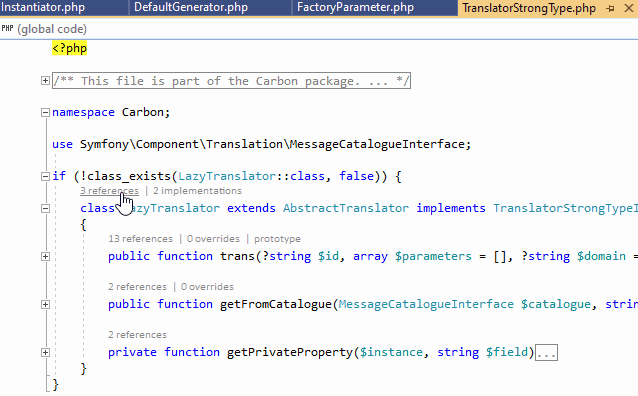
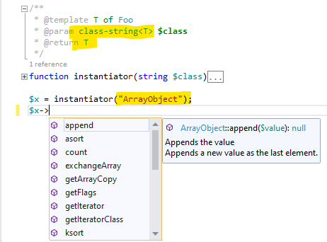

/*
Title: June 2022 (1.66)
Tags: release notes,visual studio,codelens,IntelliSense,PHP
Date: 2022-06-06
*/

# June 2022 (version 1.66)

**Downloads:** https://www.devsense.com/download<br/>
**Purchase:** https://www.devsense.com/purchase

Welcome to the June 2022 release of PHP Tools for Visual Studio!

## Code Lens

The release `1.66` introduces **Code Lenses** for PHP code. This neat feature, best known from C# in Visual Studio and from Visual Studio Code, helps with navigating through definitions and references.

Code Lenses are displayed above each function, class, interface, trait, enum, and properties. This little adornment is seamlessly showing number of references and implementations. For overriden methods, it's also providing a quick link to the parent definition (displayed as `prototype`).



The image above displays code lenses for a PHP class and PHP methods.

> The feature can be enabled or disabled in `Tools` / `Options`, under `Text Editor` / `All Languages` / `CodeLens`, the option `Enable CodeLens`. It is available in Visual Studio 2019, Visual Studio 2022, and further.

## Generic `class-string<T>`

There is a special syntax used in Documentary Comments to annotate a variable, which value should be a name of a class. It's usually used by code linters like PHPStan or Psalm.

PHPTools now use this annotation in combination with the [support for generics](https://blog.devsense.com/2022/update-php-generics). Parameters annotated with `class-string<T>`, where `T` is a template arguments, allows the editor to infer the type of `T` when possible.

Consider the following code:

```php
/**
 * @template T of Foo
 * @param class-string<T> $class
 * @return T
 */
function instantiator(string $class) { ... }
```

Now, whenever the editor know the value of `$class`, it can infer the type `T`, and thus recognize the type of `instantiator` return value. This helps user with IntelliSense, code completion, and further code analysis.



The screenshot above shows the use `instantiator()` function.

## Fixes

- Installer ensures there is .NET SDK installed; otherwise PHP projects won't work properly.
- PHP 8.1 constants dereferencing `->` supported, and not reported as syntax error anymore.

## See Also

- [Release `1.65` with Generic Types](https://www.devsense.com/en/updates/vs/v1-64#generic-types)
- [Generic Types Support](https://blog.devsense.com/2022/update-php-generics)
