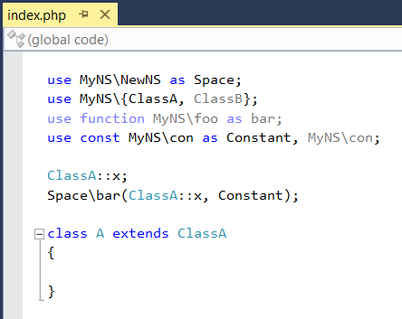

/*
Title: Declaraciones de _use_ innecesarias
Description: Unnecessary use highlighting.
*/

# Declaraciones de _use_ innecesarias

Además de los errores, PHP Tools analiza las declaraciones de _use_ y reporta aquellas que no son necesarias.
PHP Tools analiza todos los _use_ y rastrea aquellos que son utilizados para traducir el nombre de un tipo, una función o una constante.
Los _use_ que son declarados pero no aplicados se muestran como parcialmente transparentes para que puedan ser fácilmente localizados.
Los alias innecesarios son completamente funcionales: ofrecen información sobre herramientas y navegación. 
PHP Tools analiza el código contantemente y cada vez que se aplica un _use_, se muestra normalmente porque ya no es innecesario.

El siguiente ejemplo muestra un archivo con múltiples declaraciones de _use_ innecesarias.

## Funciones, constantes y _use_ en grupo

Alias de constantes y funciones, compatibles desde PHP 5.6, también son analizados por PHP Tools. 
La siguiente imagen demuestra el resaltado de la declaración _use_ para funciones y constantes.

Las declaraciones de _use_ en grupo son compatibles desde PHP 7.0 y también son compatibles con PHP Tools, así como con todas las otras características de PHP 7.0. 
Todos los _use_ en grupo son monitorizados separadamente y aquellos que no son necesarios son resaltados.
El grupo entero es reportado, pero solamente cuando todos sus _use_ no son necesarios.
El siguiente ejemplo resalta la funcionalidad: `ClassB` no se utiliza en el código y como resultado se encuentra atenuado, porque se está utilizando la `ClassA`.

Las listas de _use_ son tratadas de la misma manera que los grupos de _use_. Por ejemplo, en la lista, en la última declaración de _use_ en el ejemplo anterior, donde la segunda constante no se usa nunca.
