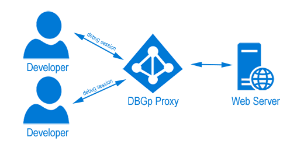
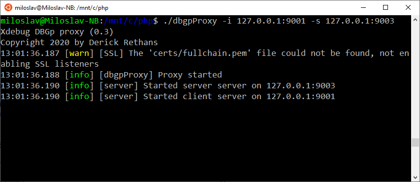
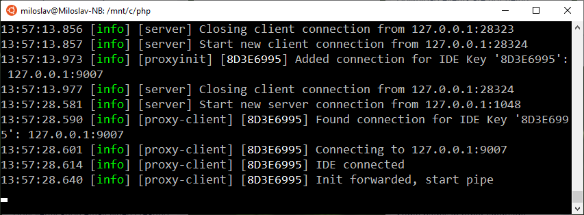

/*
Title: Multi-user debugging
Description: Debugging PHP with multiple users 
*/

# Multi-user debugging

When you want to debug a PHP application remotely on one server, you need to setup PHP to connect back to your computer. You do it by setting `xdebug.client_host` (Xdebug 2: `xdebug.remote_host`) to your IP address.

The situation gets more complicated when a team of programmers needs to debug the same application which runs just on this web server.

Xdebug doesn't allow to set more than one IP address to connect to. One option is to set `xdebug.discover_client_host` (Xdebug 2: `xdebug.remote_connect_back`). But this is not recommended, because it opens the possibility for anyone to debug your application.

The solution is to use DBGp* proxy. Each developer from the team connects to the proxy and when the debug session is initiated, Xdebug connects to the proxy which then sends the connection to the right IP address.



## Configuration

### STEP 1 -  Download and install DBGp proxy

1. Open [DBGp Proxy Tool download page](https://xdebug.org/download#dbgpProxy) and choose the executable file for your operating system.

2. Place the proxy on the web server, or any machine that is accessible by both the web server and the developers.

3. Start the proxy with `-s` argument specifing the IP for Xdebug to connect to and `-i` port where the IDE is going to contact the proxy.

 [See DBGp Proxy Tool Documentation](https://xdebug.org/docs/dbgpProxy) for more information.



#### Alternative - Download and install Komodo's DBGp proxy

1. Go to [Komodo's remode debugging package downloads](http://code.activestate.com/komodo/remotedebugging/) and get Python remote debugging client for the operating system where you want to run the proxy.

2. Place the proxy on the web server, or any machine that is accessible by both the web server and the developers.

3. The proxy is written in Python, so make sure you have it installed.

4. Start the proxy with `-d` argument specifing the IP for Xdebug to connect to and `-i` port where the IDE is going to contact the proxy.


> **Tip:**
>
>If you run the proxy and you receive this mistake:
>
> ```
> Traceback (most recent call last):
> File "./pydbgpproxy", line 106, in <module>
>   import dbgp.serverBase
> ImportError: No module named dbgp.serverBase
> ```
> You can fixed it by executing this command:
>
>`echo "export PYTHONPATH=\${PYTHONPATH}:/mnt/c/pydbgp/pythonlib" » ~/.bashrc`


### STEP 2 - Ensure Xdebug is installed and configured on the server

On the server, open `php.ini` and make sure Xdebug is configured in a way that `xdebug.client_host` (Xdebug 2: `remote_host`) points to the IP address of the proxy.

In the following case, the proxy is on the same machine as the web server; therefore, `xdebug.client_host = 127.0.0.1`. `zend_extension` points to the location of `.dll` file, because it's Windows server. In Linux case it would be `.so` file.

Xdebug 3:
```ini
[XDEBUG]
zend_extension="C:\Program Files\PHP\v8.0\ext\php_xdebug.dll"
xdebug.mode = debug
xdebug.client_host = 127.0.0.1
xdebug.client_port = 9003
```

Xdebug 2:
```ini
[XDEBUG]
zend_extension="C:\Program Files (x86)\PHP\v7.0\ext\php_xdebug.dll"
xdebug.remote_enable = on
xdebug.remote_handler = dbgp
xdebug.remote_host = 127.0.0.1
xdebug.remote_port = 9000
```

### STEP 3 - Configure PHP Tools for Visual Studio to use DBGp proxy server

1. Navigate to project properties (right click on project node in **Solution Explorer**, choose properties).

2. Select the server tab and enable the command `Use DBGp proxy`.

3. Fill the host and port where the proxy is listening. In the screenshot bellow, the host is configured to point to the proxy located on the same machine. In most cases, this will point out to a remote server.


You can click on **Verify** button to check if you are able to reach DBGp server.


4. Start the debug session by pressing <kbd>F5</kbd>

PHP Tools will try to connect to the DBGp proxy and register itself to receive the debug sessions.

> Note:
> Typically, the IDE wants the developer to choose an IDE key. This is used by the proxy to identify which developer is
> executing the request and sending the debug session to the correct machine. PHP Tools selects the IDE key 
> automatically.


On the DBGp proxy output you can see the sucessful connection from the developer.



In Visual Studio, the debug session has been initiated and breakpoint was hit.


