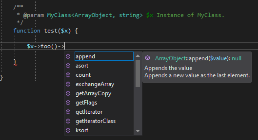

/*
Title: PHPDoc Comments
Description: PHPDoc syntax and features
Version: 1.64 and higher
*/

# PHP Documentary Comments (PHPDoc)

PHPDoc is a standard way of documenting the PHP code. It is a well-known format of block comments prefixed with `/**` characters, and it is used to annotate functions, classes, properties, and also local variables. With PHPDoc it is possible to provide documentation, additional type information, and other information for the editor.

A regular PHPDoc comment looks like the following (in case of a function documentation):

```php
/**
 * A short description.
 * @param array<int> $a A parameter summary.
 * @return int A return value summary.
 */
function foo($a) { ... }
```

In this case it would be placed right above the function declaration in the PHP code. The editor would provide a short description whenever it provides `foo` code completion, and it would treat the function as it accepts one argument of type array of integers, and returning a value of type integer.

## Generating PHPDoc

The PHP Editor will automatically generate corresponding PHPDoc stub upon typing `/**`. This works above functions, classes, interfaces, traits, properties, and constant declarations.


## Documentation

The text inside the PHPDoc is used as a documentation. It can be one or more lines of text.

## Type Annotations

There are several so-called PHPDoc tags that may be used to annotate the function parameters, function return value, property type, constant type, or a variable type. The standard PHPDoc tags are the following:

- `@param`: specifies the parameter type and description in the form: `@param (type) ($name) (description)`.
- `@return`: provides information about the return value in the form: `@return (type) (description)`.
- `@var`: allows to annotate properties, constants, class constants: `@var (type) (description)`.
- `@global`: annotates global variables within the current scope: `@global (type) ($name) (description)`.

In order to annotate a local variable, the `@var` tag is used:

```php
    /**
     * @var MyClass $x The local variable referring to my class.
     */
    $x = do_something();
```

The annotation can be placed on a single line as well:

```php
    /** @var MyClass $x */
```

Or the variable name can be omitted completely if it can be inferred from the statement below:

```php
    /** @var MyClass */
    $x = do_something(); // <-- the editor will know that $x will be MyClass.
```

### Generics

The editor understands generic type annotations (also known as templates).

The class/function with template type arguments is annotated with `@template` PHPDoc tag, optionaly specifying the template type constrain:


Notice, the tooltip for class `MyClass` shows the template arguments as well. The type constrain `Traversable` is used whenever the type `U` is not bound (whenever the editor does not know the actual assigned type), so it can provide code analytics and code completion.

In order to use the template type arguments, specify them as any other type within PHPDoc.



Notice, the editor will substitute `T` with `ArrayObject` and `U` with `string`. This results in working code completion, and the editor will properly provides completion after `foo()` which is expected to return either `ArrayObject` or `array<string>`.

### Psalm/PHPStan

The 3rd party code linters like *Psalm* or *PHPStan* introduce extended PHPDoc type annotations. Those are supported by the PHP Tools Editor as well. Types can be specified in various forms including:

- `callable(mixed...):(Option<T>)`
- `array<int, mixed>`
- `array-key`
- `non-empty-string`
- `class-name`

The editor respects those annotations but may not take the full advantage of them (yet).

## Class Annotations

- `@extends`
- `@implements`
- `@use`

## Excluding from IntelliSense

- `@ignore`

## See Also

- [Code Completion](code-completion)
