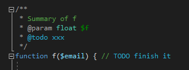

/*
Title: Syntax Highlighting
Description: Colorization of PHP syntax in code editor.
*/

# Syntax Highlighting

The Syntax highlighting feature makes PHP code more readable as any other language file integrated in Visual Studio. Script code blocks, variables, keywords, strings, script tags and comments are distinguished to make programming easier.


Moreover, when PHP Editor finds a syntax error or a logical error, the corresponding expression is underlined with a red wave and the error detail is listed in Visual Studio Error List tool window.

## Settings

PHP Editor respects standard Visual Studio colors, and defines additional PHP colors. The colors are themed, and thus work well on the both Dark and Light themes.


Modify the default Fonts and Colors in the menu `Tools` | `Options`, section `Environment` > `Fonts and Colors`.

**Used Standard Colors:**

- text
- identifier
- comment
- keyword
- operator
- number
- string
- string - escape character
- user types - classes

**PHP Colors**

- PHP - Variable
- PHP - Label
- PHP - Encapsulated Variable
- PHP - Unnecessary Code
- PHP - Inline Code
- PHP - TODOs
- PHP Doc - Delimiter
- PHP Doc - Variable
- PHP Doc - Tag

**Regex Syntax Colors** (Visual Studio 2019 and newer)

- Regex - Alternation
- Regex - Anchor
- Regex - Comment
- Regex - Grouping
- Regex - Character Class
- Regex - Other Escape
- Regex - Quantifier
- Regex - Self Escaped Character
- Regex - Text

**Used HTML Colors**

- HTML Server-Side Script
- HTML Element Name
- HTML Attribute Value
- HTML Attribute Name
- HTML Comment
- HTML Operator
- HTML Tag Delimiter

### Short Open Tags

```php
<? // <-- short open tag, usually not enabled

?>
```

The editor respects the `short_open_tag` directive in the corresponding `php.ini` file. By default, it enables them for PHP &lt; 7.0. Otherwise the short open tags are treated as XML tag and their content is not colorized as PHP code.

To override the default behavior and enable the short open tags, edit the Visual Studio project file (`.phpproj` file), and add the following XML fragment:

```xml
<PropertyGroup>
  <LanguageFeatures>ShortOpenTags</LanguageFeatures>    
</PropertyGroup>
```

Reload the project if necessary.

> Note, short open tags were disabled by default since PHP 7.0.

## PHPDoc Highlighting

PHPDoc content (within `/** */` comments) is also colorized. Its tags contained type names and variable names are colored according to the settings above.

## TODO Highlighting

User's to-do comments are both listed in Visual Studio's [_Task List_](task-list) window, and highlighted in the source code.



## Type Names and Highlighting

Type names are highlighted with the color respecting the color name `User Types - Classes`.

## Highlighting braces

Matching pair of braces are automatically highlighted as well. Upon moving the keyboard caret at the outer position next to any brace (`(`, `)`, `[`, `]`, `<`, `>`), it gets highlighted together with its matching brace.


You can also jump between matching braces using the keyboard shortcut (by default `Ctrl`+`]`).

In the Visual Studio 2019 and newer, matching parenthesis within PCRE are also highlighted.

## Brackets pair colorization

When dealing with nested brackets it can be hard to figure out which brackets match and which do not. Colorizing bracket pairs with different color makes it easier to read the code.


In the Visual Studio 2022, there is an extension which adds colors to bracket pairs - [Rainbow Braces](https://marketplace.visualstudio.com/items?itemName=MadsKristensen.RainbowBraces). 

PHP Code is supported since version `1.0.23`. At this time

https://blog.devsense.com/2022/bracket-pair-colorization-for-php-in-visual-studio

## Switching Themes

When switching to a different color theme (e.g. Dark Theme), all built-in colors are switched as well to their default, respecting the new theme. PHP colors respect the Dark and Light themes.

## See also

- [Task List](task-list)
- [Semantic Token Highlighting](word-highlighting)
- [Twig Editor](twig)
- [Smarty Editor](smarty)
- [Blade Editor](blade)
