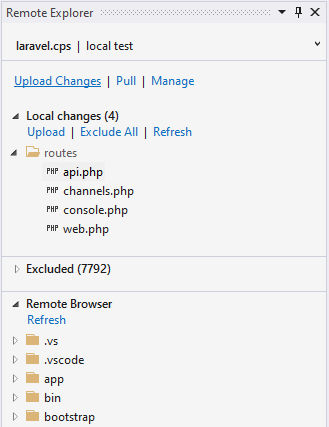
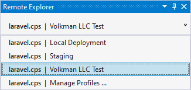
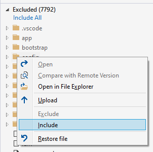

/*
Title: Remote Explorer
Description: Synchronizing files between remote host and local machine
*/

# Remote Explorer

Version 1.56 introduces **Remote Explorer** tool window which provides the following features:

- **Browsing** Remote Files.
- **Uploading** local modifications to the remote host.
- **Reverting** local modifications.
- **Tracking** locally modified files.
- **Including and Excluding** files and folder from the upload/publish process.
- **Downloading** remote files and folders to the project or to a custom folder.
- **Comparing** a local file with the remote file.
- **Managing** remote connections.

## Opening the Tool Window

To open the Remote Exlorer, either

- Go to menu `View` / `Other Windows` / `Remote Explorer`.
- Right click on a PHP Project in Solution Explorer, and choose `Publish`. The project **must not** be a *Microsoft Publish* project.

## Switching Profiles

The tool window works with the selected project and remote profile. In case there are more profiles, choose the current one in the upper drop down box.

The drop down also allows to manage profiles for a specified project, to create new profiles, remove profiles, or rename profiles.

## Uploading Files to Remote

- **Upload Changes** - uploads all the files listed in `Local changes` to the server.
- **Upload** - is the same as `Upload Changes`.
- **Right Click** / **Upload** - only specified file or folder can be uploaded with mouse right click inside the `Local Changes` or `Excluded` sections.

## Getting Files from Remote

- **Pull** - downloads al the files from remote host to the project directory.
- **Restore** - option in the context menu, upon right clicking on a file or a folder inside `Local Changes` or `Excluded` sections. Local modifications will be overwritten with files from the remote host.
- **Pull to Project** - option in the context menu in the `Remote Browser` section. This allows to download only selected file or folder to the project, respecting the relative file locations.
- **Pull to ...** - this option in the context menu in the `Remote Browser` asks for a folder on the local computer, and downloads the files there.

## Local Changes Menu

`Local Changes` section provides additional context menu options. Right click on a file or a folder to access the following:

- Open file in the Visual Studio editor.
- Compare local file with remote version
- Upload single file or folder to the remote host
- Exclude or Include the file or folder from the list of local changes
- Restore the file from the version on the remote host

### Comparing Local Changes

The `Compare with Remote Version` context menu checks the differences between the local file and the same file on the remote host using the Visual Studios *diff* window. The window highlights different lines, and characters, and allows to further modify the local file to see the differences immediatelly.

### Include, Exclude

Local changes can be excluded from the `Local changes` tree with the `Exclude` context menu command, or the `Exclude All` button. Excluded items won't be uploaded upon initiating the `Upload Changes` command.

Excluded items can be included back in the `Excluded` part of the Remote Explorer.

## Remote Browser

The last section of the *Remote Explorer* tool window provides access to the remote host files. The list of files is obtained from the remote host only when the section is expanded.

Files in the list can be opened, which downloads them locally and opens them in the Visual Studio editor. Other options are `Pull to Project` and `Pull to ...` which downloads them to the local directory respectively.

## Related links

- [New Project](new-project) - creating a new PHP project, either empty or from a template.
- [New Project from Remote location](new-project-remote) - creating a new PHP project that is initialized with files from a remote location, and setups both-way synchronization.
