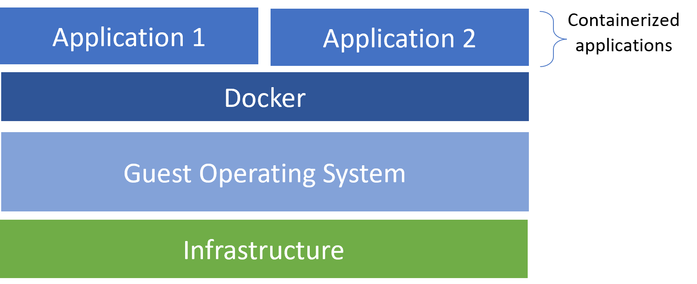

/*
Title: Docker 
Description: 
*/

# Docker

The Docker allows the developers to have separate environment for the project in the container - isolating it from local system. When you need to switch to different project, with different dependencies, tools or system, you can just switch to a different container.



To find out more about Docker please follow the [Introduction to PHP on Docker with VS Code](https://blog.devsense.com/2019/introduction-to-php-on-docker-with-visual-studio-code)

PHP Tools for VS Code can work with docker containers in two modes:

 - Running VS Code fully in local environment
 - Running VS Code client locally, but server remotly. This is possible thanks to [Remote Containers extension](https://marketplace.visualstudio.com/items?itemName=ms-vscode-remote.remote-containers). This setup is prefered one, since you actually working completly in the container. 

## Running VS Code locally

This scenario is explained in great detail in the last part of the article series about PHP and docker, you can follow the article [here](https://blog.devsense.com/2019/debugging-php-on-docker-with-visual-studio-code).

### Prerequisites 
- [Docker VS Code Extension](https://marketplace.visualstudio.com/items?itemName=ms-azuretools.vscode-docker)
- [Docker Desktop](https://docs.docker.com/desktop/)
- A [Docker Hub](https://hub.docker.com/signup) account. 

### Docker containers

You can have your PHP application in single container defined in simple the [Dockerfile](https://docs.docker.com/engine/reference/builder/) e.g.:

```
FROM php:8.1-cli
RUN pecl install xdebug
RUN docker-php-ext-enable xdebug
```

The lines above define single container based on php:8.1-cli. Then they instruct docker to install Xdebug through [PECL](https://pecl.php.net/) and enable it with `docker-php-ext-enable`.

Usually more complex setup is required and the application will need multiple containers. You can achive that with [Docker Compose](https://docs.docker.com/compose/). This scenario is explained in the article [PHP and Nginx on Docker](https://blog.devsense.com/2019/php-nginx-docker)

### Xdebug

Xdebug configuration is almost identical to the usual setup. Please choose installation guide depending on the platform in your docker image:
 - [Xdebug on Linux](xdebug-linux)
 - [Xdebug on Windows](xdebug-win)
 - [Xdebug on Mac](xdebug-win)

The major difference is in `client_host` (`remote_host` in Xdebug 2) option. You need to use a special value `host.docker.internal` which will be automatically replaced with the IP address of Docker Host. 

### launch.json

Since the paths in the docker container differ from your local environment, the debugger needs to know how to map them. This can be specified in the `launch.json` file.

Follows the example of the launch.json with configured path mapping:
```
{
"name": "Listen for Xdebug",
"type": "php",
"request": "launch",
"port": 9003,
"pathMappings": {
"/var/www/html": "${workspaceFolder}\\data"
},
```
The path mapping specifies that everything located in `/var/www/html` on docker container is mapped to `${workspaceFolder}\data` in our local system.

## Running VS Code remotly

> This section is not complete yet. We are preparing detailed tutorial on how to set it up.
