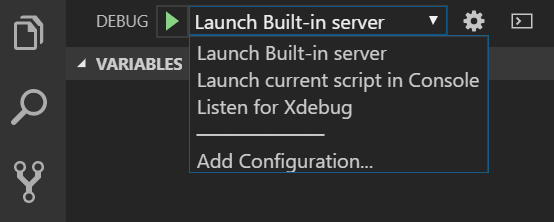

/*
Title: Launch Profiles
Description: Configuration of the debugger.
*/

# Launch Profiles

Launch profiles define the way Visual Studio Code Debugger executes the project. The profiles can pass parameters to the debugger to modify its function.

## launch.json

Visual Studio Code stores debugging configuration in a `launch.json` file located in a .vscode folder in a workspace (project root folder) or in user or workspace settings. The file can contain multiple profiles that can be selected before starting the debugger in the Debug pane in VS Code.



## Web Application

The following profile starts the PHP built-in web server. The server is started only if the `runtimeArgs` contains the parameter `-S` that defines the location and port of the server.

**Sample configuration:**

```json
{
    "name": "Launch Built-in server",
    "type": "php",
    "request": "launch",
    "runtimeArgs": [
        "-S",
        "localhost:8888",
        "-t",
        "\\remotepc\Shared\Test"
    ],
    "pathMappings": {
        "\\remotepc\Shared\Test\": "${workspaceRoot}\src",
        "\\test": "C:\Users\usr\Documents\VSCode\src\"
    },
    "port": 9000,
    "serverReadyAction": {
        "action": "openExternally"
    }
}
```

Additonally, there are following settings:

- **"port"** allows you to specify the Xdebug port number. This value is used set to configure the built-in server and the VSCode debugger togetherThe default is `9000`. It overwrites the setting `xdebug.remote_port` in your `php.ini`.
- **serverReadyAction** can be set to automatically open browser once the debug starts. More at [code.visualstudio.com - serverReadyAction](https://code.visualstudio.com/docs/editor/debugging#_automatically-open-a-uri-when-debugging-a-server-program).

## Console Application

This profile runs the PHP project as a console application, inside the VS Code's `Debug Console`. By default it starts a file currently opened in the editor.

```json
{
    "name": "Launch current script in Console",
    "type": "php",
    "request": "launch",
    "program": "${file}",
    "cwd": "${fileDirname}",
    "externalConsole": false,
    "port": 9000
}
```

Useful parameters that can be changed:

- `program`: Specifies a file absolute or relative to workspace's directory. Value `${file}` means the file currently opened in the editor.
- `externalConsole`: `true` to run the program in a separate command line window. Default is `false` to output the program in the VS Code's `Debug Console`.
- `port`: is the Xdebug port number. This value has to match setting in     `php.ini`. Defaults to `9000`.

## Remote Application (Attach)

The following basic profile informs the debugger that it should try to connect to an already running Xdebug server. PHP Tools won't start any server, because there is no `program` or `runtimeArgs` parameter, like in the previous profiles.

```json
{
    "name": "Listen for Xdebug",
    "type": "php",
    "request": "launch",
    "port": 9000
}
```

## Debug Current Script

Whenever there is no `launch.json` file present, PHP Tools' debugger launches the current PHP script in the VS Code's `Debug Console`.

## DBGp Proxy settings

To setup multi-user debugging you can follow [tutorial for Visual Studio version](https://docs.devsense.com/vs/debugging/multi-user). The only difference is the settings in VS Code version is in `launch.json` file.

To configure DBGp proxy open `launch.json` and add this snippet to the launch configuration.

```json
"dbgpProxy":
{
  "enable": true,
  "host": "127.0.0.1",
  "port": 9002
}
```
- `enable` specifies whether PHP Tools will try to connect with DBGp server
- `host` and `port` specifies the address of the DBGp proxy server

IDE key is setup automatically from the name of the user logged in. When debug session starts you can see it in the Debug Console:

```
Registering with the DBGp proxy on 127.0.0.1:9002 with key Arnold...
Registration was successful!
```

The ide key has to be present in the url when accessing the web server (e.g. `http://example.org?XDEBUG_SESSION_START=Arnold`). This way the proxy server knows which machine to connect back to with the debug session.

## PHP Version

The launch configuration option `"phpVersion"` allows to choose which PHP will be used to initiate the debug.

It is possible to define more launch configurations, each with a different PHP version. While the workspace assumes one PHP version at a time [see php.version setting](https://docs.devsense.com/vscode/editor/php-version-select), launch configuration can specify its own PHP to be used for built-in web server and a console application.

**Example:**

```json
{
    "name": "Launch Built-in Server with PHP 8",
    "type": "php",
    "request": "launch",
    "runtimeArgs": [
        "-S",
        "localhost:8888",
        "-t",
        "."
    ],
    "phpVersion": "8.0"
}
```

> Note: In this example, it is assumed that the PHP 8.0 is installed on the local machine.

## Related Links

- [Compound Launch and Debug](https://blog.devsense.com/2021/compound-launch-vs-code-php) - Start and debug more built-in servers at once.