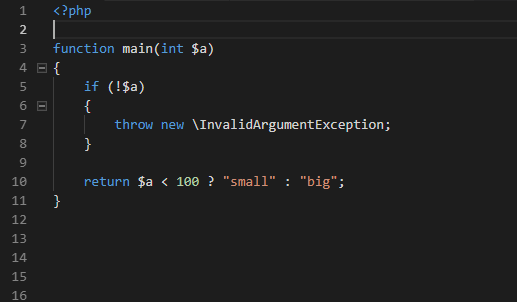
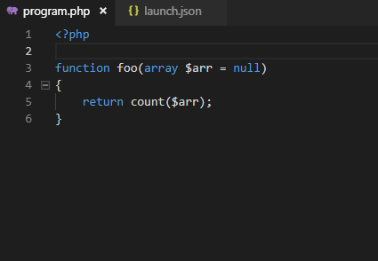

/*
Title: Writing PHPDoc
Description: Writing and generating PHPDoc comments
*/

## PHPDoc Completion

PHPDoc block is completed by typing '`/**`'. This features requires you to enable `Format On Type` setting (`"editor.formatOnType": true`).



PHPDoc tags are completed by typing '`@`' inside the PHPDoc block.



## PHPDoc Generation

The PHPDoc block is generated automatically by typing '`/**`' above the following constructs:

- function
- class
- namespace
- properties
- constants

The generated PHPDoc block contains inferred types, exceptions, and lists function parameters.

## PHPDoc Type Hints

Type hints within PHPDoc comments are analyzed and used for purposes of code completion and type analysis. See the sample below for type hinting the parameter `$x` of function `foo`. For more details on code completion see [completion documentation](completion).

```php
<?php

/**
 * @param array|bool $x The parameter description.
 */
function foo($x) {
    //
}
```

## See Also

- [Generics in PHP using PHP DocComments](https://blog.devsense.com/2022/generics-in-php-using-phpdoc)
