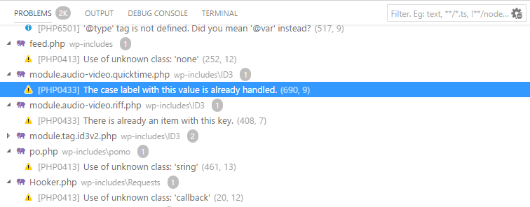

/*
Title: Problems
Description: Problems and code validation
*/

# Problems and Code validation

The entire workspace is continuously analyzed for potential issues and problems. They are all listed in the VSCode's Problems window where the user can filter and navigate to certain issues.



## Configuration

### `php.problems.workspaceAnalysis`

By default, PHP Tools scans continuously the entire workspace for possible issues and problems. In case this is not desired, set the setting `php.problems.workspaceAnalysis` to `false`. This will cause the VSCode to only watch and analyse the opened PHP documents, and documents that contains some related declarations.

```json
'php.problems.workspaceAnalysis' : false
```

### `php.problems.exclude`

The setting allows to exclude problems found in specified files or entire directories from being shown in *Problems* panel. There are two possible values:

```json
'php.problems.exclude' : {
    'path' : true,
    'path' : [1111, 2222],
}
```

- Boolean value `true` marks the files or directories matching given glob pattern `path` to be excluded in problems panel.
- Array value `[]` may contain only specific problem codes to be excluded within files matching the glob pattern `path`.

Any rules matching the same folder are merged, as depicted on the sample below. The sample disables all warnings in 'vendor' directory and disables additionaly one warning `PHP0406` in the entire project.

```json
'php.problems.exclude' : {
    '/' : [406],
    'vendor/' : true,
}
```

## Related links

- [Configuration](configuration)
