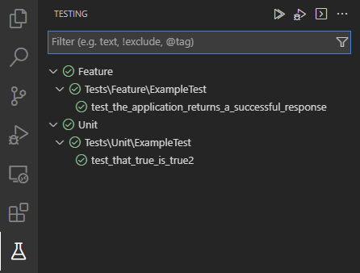
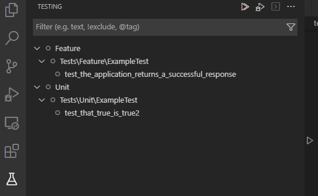

/*
Title: Test Explorer
Description: Visual PHPUnit test explorer
*/

# Test Explorer

The Test Explorer view enables the visual execution and debugging of PHPUnit tests. The tests are executed by the PHPUnit and the results are displayed in the **Test Explorer**, as shown in the next figure. The PHPUnit output is shown in the **PHP (PHPUnit)** output tab.



Each test is listed in the Test Explorer view. In the code, tests are annotated with the test icon. The icon shows the current test status, and allows to quickly *Run*, and *Debug* the test.

## Configuration

It is necessary to [configure](configuration) the editor before the tests can be executed. The process requires PHP, the PHPUnit package and a PHPUnit configuration file.

Tests are resolved quickly by parsing the `phpunit.xml` or `phpunit.xml.dist` files, and corresponding `.php` files in the workspace. Any changes to those files will automatically update the Test Explorer as well.

### PHP

Running the tests relies on the configured PHP executable. See [editor/php-version-select](Selecting PHP Executable) for more details.

By default, the workspace is configured to use the global `php` command.

### PHPUnit

The PHPUnit phar file or PHPUnit composer package are necessary to execute the tests. PHP Test Explorer uses the following PHPUnit:

1. From the vendor directory, usually created by composer.
2. Otherwise the PHPUnit PHAR (version 6.5.12.) bundled with PHP Tools.

In case there is the `phpunit/phpunit` composer package, it is used implicitly for the tests execution.

To manually specify path to the `phpunit` binary, use setting `phpunit.phpunit`. *Example setting:*

```json
{
    "phpunit.phpunit" : "${workspaceFolder}/phpunit"
}
```

If none of the above is found, PHPUnit PHAR (version 6.5.12.) bundled with PHP Tools is used.

### Configuration File

The tests rely on the `phpunit.xml` or `phpunit.xml.dist` configuration files ([PHPUnit configuration](https://phpunit.de/manual/6.5/en/appendixes.configuration.html)), which should be placed in the root of the workspace.

### Tests

The name, location, extension and settings of the tests are defined in the `phpunit.xml` configuration file. 
The tests should be located in a sub-directory, not directly in the workspace root, because PHPUnit does not recognize them there.

## Test Explorer View

Test Explorer View provides tools for manual and automatic test execution with visual representation of the results. The view is only visible if there are some tests or the `phpunit.xml` configuration file in the workspace.



## Debugging Tests

Tests can be debugged with Xdebug by clicking the bug-like icon  in the Test Explorer view, or *Debug Test* command in the test margin. The debugging process is the same as [standard debugging](Debug). The Test Explorer can debug one or more tests at once.


## Test Results

Test results are displayed:

- the Test Explorer view shows small icons next to each test and the test run duration. The icons meaning is:
  *  - The test was executed without errors.
  *  - The test was executed with errors; the error message is in the output tab.
  *  - The test was executed and skipped (see [incomplete-and-skipped-tests](https://phpunit.de/manual/6.5/en/incomplete-and-skipped-tests.html)).
  *  - Test is currently running (this is shown usually during debugging).
- the icon next to each test right in the code shows icon with the last test result as well.
- failures are displayed inline, right on the failed assertion:
  

The actual result of the PHPUnit execution is displayed in the **PHP (PHPUnit)** output tab, while each test has its own output available by clicking on the test in the Test Explorer View.


