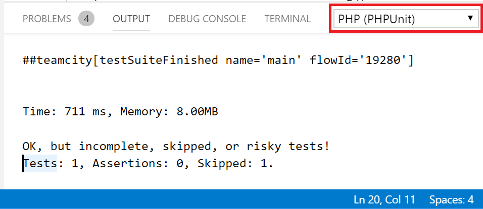
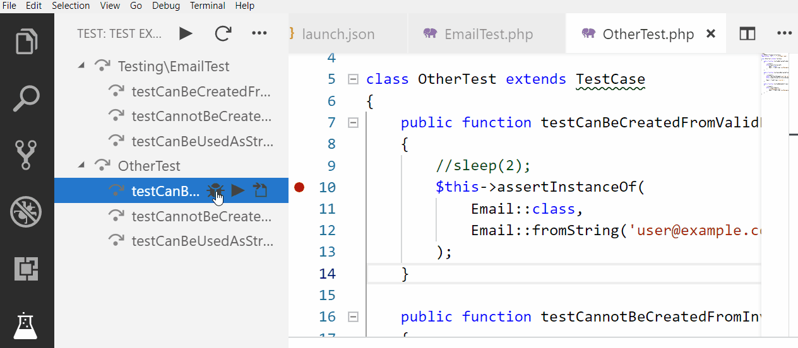
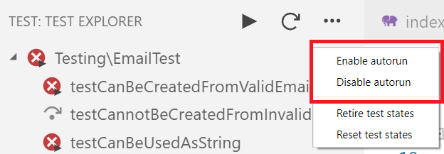

/*
Title: Test Explorer
Description: Visual PHPUnit test explorer
*/

# Test Explorer

The Test Explorer view enables the visual execution and debugging of PHPUnit tests. The tests are executed by the PHPUnit and the results are displayed in the **Test View**, as shown in the next figure. The PHPUnit output is shown in the **PHP (PHPUnit)** output tab.

## Configuration

It is necessary to configure the system before the tests can be executed. The process requires PHP, the PHPUnit phar file and a configuration file. 

> Internally, PHP Tools resolves the tests by executing **php -d display_errors=on PHPUnit.phar --teamcity** in the workspace root directory. This command relies on the *phpunit.xml* to be present in the root. The configuration file must identify all the desired tests and provide all the settings to PHPUnit.

### PHP

Tests require working PHP runtime, which is either:
1. The command specified by the *php.executablePath* value in the user's settings.
2. *php* on the command line if the setting is not present.

### PHPUnit

The PHPUnit phar file is necessary to execute the tests and PHP Tools tries to locate PHPUnit phar in:

1. The vendor directory, usually created by composer. 
2. Built-in PHPUnit phar (version 6.5.12.) distributed with PHP Tools, in case the phar file is not found in the vendor directory.

### Configuration File

The tests rely on the *phpunit.xml* configuration file ([PHPUnit configuration](https://phpunit.de/manual/6.5/en/appendixes.configuration.html)), which must be placed in the root of the workspace.

PHP Tools can generate a basic configuration file, if it locates any tests and the configuration file is missing. 
If the configuration file is missing and PHP Tools locates any files named \*test.php, it will offer to create a basic configuration via pop-up message.

### Tests

The name, location, extension and settings of the tests are defined in the phpunit.xml configuration file. 
The tests should be located in a sub-directory, not directly in the workspace root, because PHPUnit does not recognize them there.

## Test Explorer View

Test Explorer View provides tools for manual and automatic test execution with visual representation of the results.
The view is only visible if there are some tests or the phpunit.xml configuration file in the workspace.

## Test Results

Test results are displayed in the test explorer view as small icons next to each test with the following meaning:

*  - The test was executed without errors.
*  - The test was executed with errors; the error message is in the output tab.
*  - The test was executed and skipped (see [incomplete-and-skipped-tests](https://phpunit.de/manual/6.5/en/incomplete-and-skipped-tests.html)).
*  - Test is currently running (this is shown usually during debugging).

The actual result of the PHPUnit execution is displayed in the **PHP (PHPUnit)** output tab, while each test has its own output available by clicking on the test in the Test Explorer View.

## Debugging Tests

Tests can be debugged with Xdebug by clicking the bug-like icon  in the Test Explorer View. Tests can be debugged one at a time, it is not possible to debug all tests at once. The debugging process is the same as [standard debugging](Debug).

## Continuous Testing

Tests can be executed continuously by enabling autorun in the Test Explorer View. Once enabled, tests will be executed every time a tested file is saved after modification.

