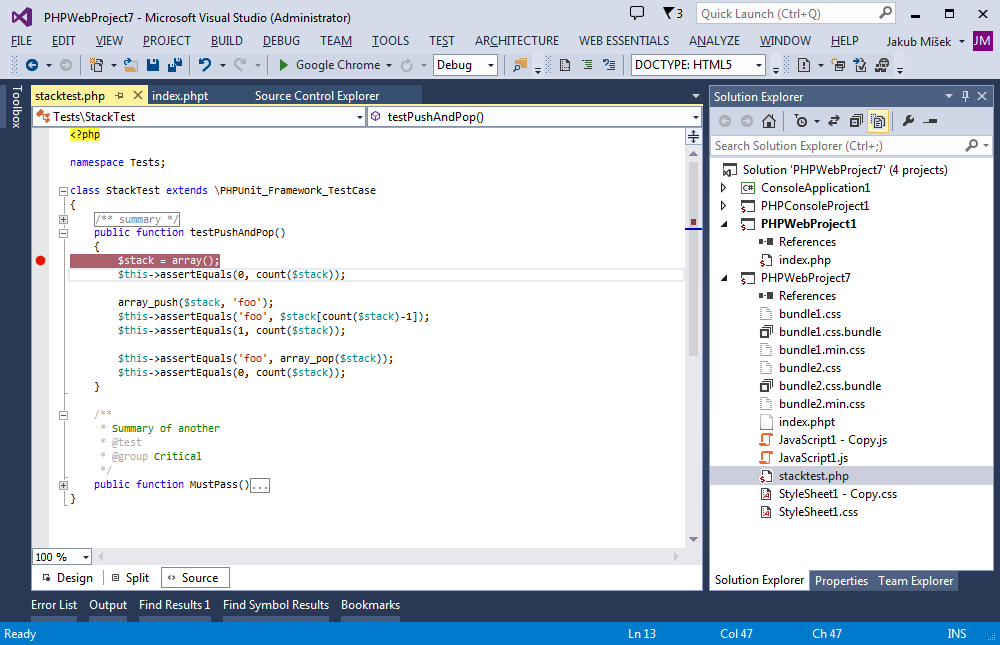
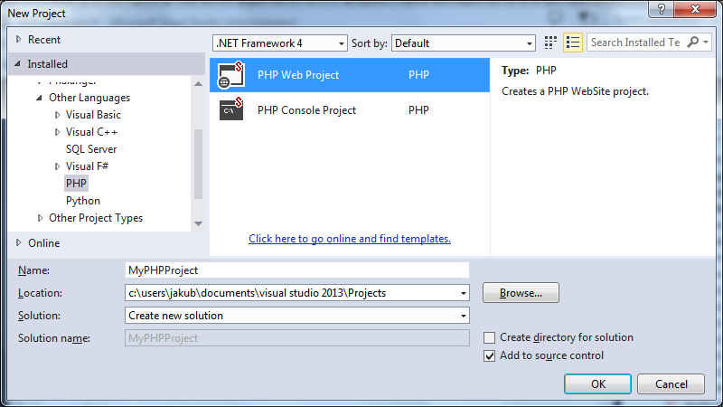
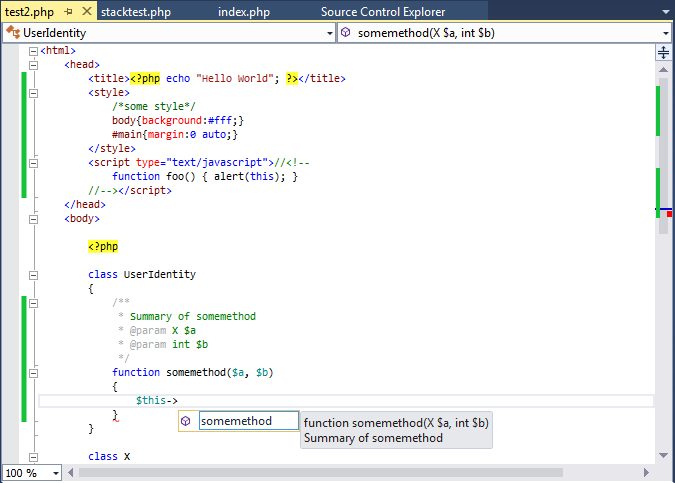
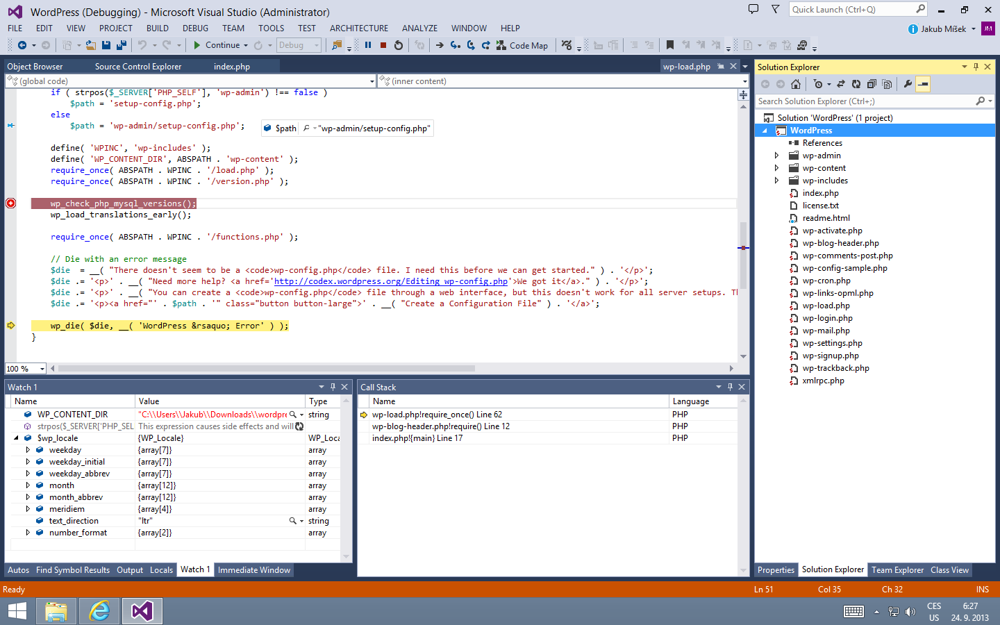

/*
Title: Getting Started
Description: PHP Tools documentation home page.
*/

# Getting Started with PHP Tools

Welcome to PHP Tools for Visual Studio. The following guide will help you with the basics, so you can quickly start working with PHP in Microsoft Visual Studio.

> **Note:** PHP Tools for Visual Studio is a Visual Studio extension. Please note, licensing of **Visual Studio Express** does not allow the extensibility. Thus PHP Tools does not support VS Express editions.

  
<a href="http://www.youtube.com/watch?v=UHlk9IFsaZU" class="popup-youtube" id="PHPToolsOverview" title="PHP Tools for Visual Studio Overview">

</a>

## Getting to know the IDE

The Visual Studio main window is divided into several areas - menu bar, status bar, editor area, side panel containing the Solution Explorer, and various toolbars. All the positions can be changed. The following image describes the default layout.

When you launch Visual Studio, you are welcomed with the Start Page. This allows you to open recent projects or create new ones quickly.

When a project is opened, you can see the files that are a part of the project in the Solution Explorer. The Solution Explorer allows you to manage, search and open files, their properties and the project properties.

The editor area contains opened files. It allows you to see and modify the content, and take advantage of advanced IntelliSense features, navigation features, syntax highlighting, live error detection and more.

## First PHP project

Most of the features in Visual Studio work within the context of a project. Debugging, IntelliSense, testing or configuring web server depends on a PHP project. The project corresponds to a single application or a library, it can be bound to a source control or configured to publish modified files onto a remote server.

Projects in Visual Studio work with a local copy of your files. To push them on a server, you have to deploy your files - either by configuring automatic publish or by your own.

There are several ways to create a new project in Visual Studio by:

- Creating a new PHP project from scratch.
- Creating a PHP project around existing files.
- Importing existing files into a project.

### New PHP Project from Scratch

An empty PHP Project is the simplest way of getting started with PHP Tools. Go to 'Menu | File | New | Project' and look for 'PHP' group. Find the project template you need and confirm.

Additional files and directories can be added in various ways:

- In `Menu` or `Solution Explorer | Project | Add New Item`
- Drag & Drop from Windows Explorer into Solution Explorer
- Enabling Show All Files in Solution Explorer to see all the files physically present within the project directory and including them into the project

### New Project in an Existing Folder

If you already have files in a local folder, you can create PHP Project in that folder with all the files included. Navigate to `Menu | File | New | Project From Existing Code ...` (Note availability of this feature depends on Visual Studio edition) and walk through the wizard steps.

### Importing Local Files to a Project

If you already have a project, you can add existing files. See New PHP project from scratch for more information.

## Editing a PHP File

PHP Tools provides Visual Studio with a smart editor of PHP files.

This allows you to work with great overview of your code, taking advantage of navigation bar, outlining, syntax highlighting; even with PHP, HTML, JavaScript or CSS mixed together, smart auto-completion <kbd>Ctrl+Space</kbd> taking into account the current code context, tooltip assistance, help integration <kbd>F1</kbd>, jump to definition <kbd>F12</kbd> and live error underlining helping you to build error-free code.

Built-in code snippets help you to write code fast avoiding typos. You can insert a code snippet <kbd>Ctrl+K,X</kbd> like new function body, for loop, try/catch construct and more to speed up your development. Newly inserted snippet is automatically formatted and cursor position moved directly inside the new code so you can type your code instantly. Moreover selected area of a code can be surrounded by a snippet <kbd>Ctrl+K,S</kbd> to avoid the need of copy-pasting and other refactoring.

## Run and Debug Your PHP Project

Once you have your PHP Project, you can run the application and debug. Debugging allows you to run the application and stopping on breakpoints <kbd>F9</kbd>, stepping on the next line <kbd>F10</kbd>, inside a function call <kbd>F11</kbd>, out of the function call <kbd>Shift+F11</kbd> or inspecting and modifying variables. You can see e.g. local variables, super-global variables and current call stack.

To run and debug the project, ensure it is properly configured (see below) and press <kbd>F5</kbd> (or in `Menu | Debug | Start Debugging`). You can also run the project without debugging by pressing <kbd>Ctrl+F5</kbd>.

### Configuring PHP

Running the application locally requires properly configured PHP. To enable support for debugging, PHP extension Xdebug has to be installed and configured as well.

PHP Tools help with the setup in two ways.

Once you start your first application <kbd>F5</kbd> and there is no valid PHP installation found, you can download and setup a recommended version of PHP with pre-configured Xdebug within one click from Microsoft Web Platform Installer. This is the most recommended option for most users.

For users with custom requirements or requiring to use their existing PHP installation, PHP Tools help by checking the configuration and suggesting recommended fixes eventually.

The issues dialog is shown automatically if there is an issue with configuration during the project startup. It can also be invoked manually from `Menu | Tools | Options`, in `PHP Tools | Interpreter`, by clicking onto **View Recommendations**.

A list of PHP installations and their configuration can be found in `Menu | Tools | Options`, in `PHP Tools | Interpreter`. You can see the version of PHP, whether Xdebug is detected and whether there are possible configuration issues. In case of an issue, you can click on the **View Recommendations** warning and automatically apply the recommended and suggested settings.

### Remote Debugging and Custom Web Server

To run the application on a remote server or locally using a not-listed Web Server, go to project properties. Select **Custom Web Server** and enter its URL.

In this case, PHP and Xdebug configurations are not checked whether they are installed or configured properly. You have to make sure that:

- The project files are published onto the remote server before debugging or the web server is mapped onto your local project folder.
- PHP and Xdebug are configured on the custom web server.
- Xdebug configuration allows remote debugging.
- Custom server is running and is accessible from the URL you specified.

## Test Your Application

PHP project integrates into Visual Studio Test Explorer. Go to `Menu | Test | Windows | Test Explorer` to manage the test cases. Project files are scanned and PHP Unit test cases are automatically listed within the **Test Explorer** window.

Within the window, you can start or debug your test cases using built-in PHP Unit framework.
> **Note:** availability of the Test Explorer feature depends on your edition of Visual Studio.

## Customization

The Visual Studio environment is fully customizable. Most common tasks you may want to customize are listed below.

### File Extension Being Opened by PHP Editor

In addition to default .php file extension, you can configure other file extensions to be edited with PHP editor capabilities. This is useful when you work on projects using non-standard file extensions for PHP script file, like .php5, .inc or .module. Go to `Menu | Tools | Options`, into section `Text Editor | File Extensions`, and map additional file extensions you need to PHP Editor.

### Fonts and Colors

PHP Editor respects current users color scheme. Any color in the editor or in Visual Studio environment itself can be configured. Go to `Menu | Tools | Options`, in section `Environment | Fonts and Colors`, and modify any display item listed. PHP specific colors are prefixed with **PHP**. Other colors are shared with Visual Studio built-in colors - Identifier, Keyword, Comment, String, Number, Text.

### Keyboard Mappings

PHP Tools respects the Visual Studio keyboard scheme. Shortcuts used to work with your projects and editor can be managed in `Menu | Tools | Options`, in the section `Environment | Keyboard`.

### PHP Editor Options

Options of PHP Editor includes adjustment of code formatting behavior, change tab sizes, fine-tune IntelliSense, disable outlining of various code blocks and more. Go to `Menu | Tools | Options`, and navigate to section `Text Editor | PHP` for additional settings.

## That's It

Thank you for reading our quick start guide. There is much more you can do with Visual Studio and PHP Tools. For more tips and/or questions, please see the rest of the documentation and the product's features page.