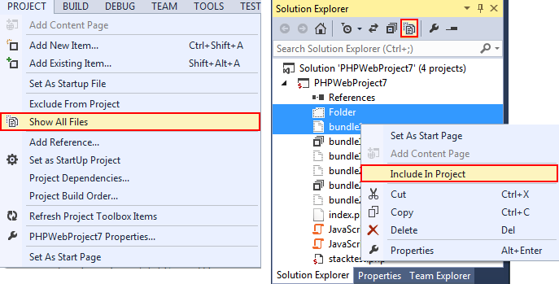
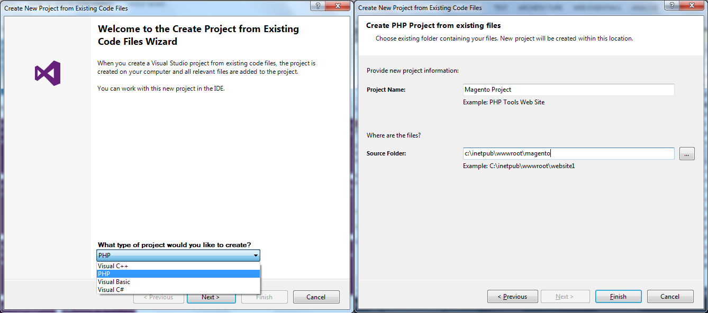
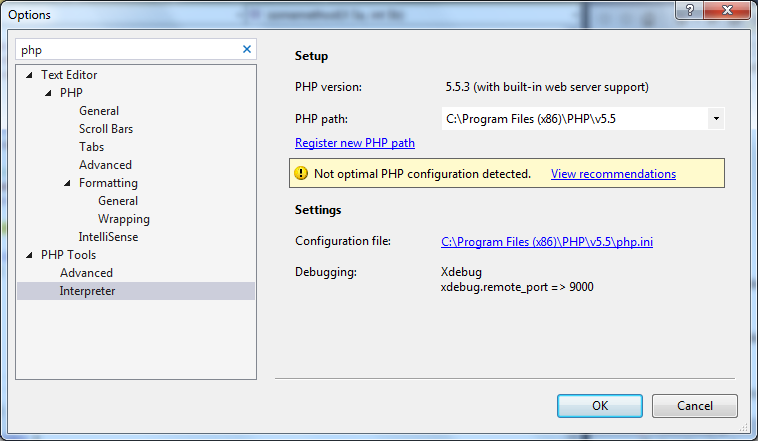

/*
Title: Comience a utilizar PHP Tools
Description: Página de inicio de la documentación de PHP Tools.
*/

# Comience a utilizar PHP Tools

Bienvenido a PHP Tools for Visual Studio. Esta guía le mostrará los pasos básicos para comenzar a trabajar rápidamente en PHP con Visual Studio.

> **Nota:** PHP Tools for Visual Studio es una extensión de Visual Studio. Por favor tenga presente que poseer una licencia de Visual Studio no habilita directamente la extensión. También debe saber que PHP Tools no es compatible con las **ediciones Express de Visual Studio**. 

  
<a href="http://www.youtube.com/watch?v=UHlk9IFsaZU" class="popup-youtube" id="PHPToolsOverview" title="PHP Tools for Visual Studio Overview">

</a>

## Conozca el IDE

La ventana principal de Visual Studio está dividida en diferentes áreas – la barra de menú, la barra de estado, el área de edición, el Explorador de soluciones en la barra lateral y otras barras de herramientas. Todas las posiciones pueden ser cambiadas. En la siguiente imagen se muestra la disposición estándar:

Al abrir Visual Studio, aparece la página de inicio. Esta página permite abrir proyectos recientes o crear proyectos nuevos rápidamente.

Los archivos que son parte del proyecto aparecerán en el Explorador de Soluciones. El Explorador de Soluciones permite controlar, buscar y abrir archivos, sus propiedades y las propiedades del proyecto.

El área de edición contiene los archivos abiertos. Permite ver y modificar el contenido, aprovechar las funciones avanzadas de IntelliSense, las funciones de navegación, el resaltado de sintaxis, la detención automática de errores y más.

## Primer Proyecto PHP

La mayoría de las funciones de Visual Studio trabajan dentro del contexto de un proyecto. El depurador, las pruebas, la función IntelliSense o la configuración del servidor web dependen de un proyecto PHP. El proyecto puede corresponder a una sola aplicación o a una biblioteca, puede estar unido al control del código fuente o estar configurado para publicar archivos modificados en un servidor remoto.

Los proyectos en Visual Studio trabajan con una copia local de sus archivos. Para publicarlos en un servidor necesitará implementar sus archivos, ya sea configurándolos automáticamente para su publicación o publicándolos usted mismo.

Hay varias maneras de crear un proyecto nuevo en Visual Studio. Usted puede:

- Crear un nuevo proyecto PHP desde cero. 
- Crear un proyecto PHP con archivos existentes.
- Importar archivos existentes para un proyecto.

### Crear un nuevo Proyecto PHP desde cero

Crear un proyecto PHP vacío es la manera más sencilla de comenzar a utilizar PHP Tools. Vaya a `Menú | Archivo | Nuevo | Proyecto` y haga clic en “PHP”. Elija la plantilla que necesite y confirme.

Archivos adicionales y directorios pueden ser añadidos de diferentes maneras, por ejemplo:

- Desde el `Menú` o en el `Explorador de soluciones | Proyecto | Añadir nuevo` 
- Arrastrando desde Windows Explorer y soltando en el Explorador de soluciones.
- Habilitando “Mostrar todos los archivos en el Explorador de soluciones” para ver todos los archivos físicamente presentes dentro del directorio del proyecto y así poder incluir los que necesite.

### Crear un nuevo proyecto en una carpeta existente

Si ya posee archivos en una carpeta local, puede crear un proyecto PHP en esa carpeta con todos los archivos incluidos. Haga clic en `Menú | Archivo | Nuevo | Proyecto a partir de código existente...` y siga los pasos del asistente. Tenga en cuenta que la disponibilidad de esta función depende de la edición de Visual Studio.

### Importar archivos locales a un proyecto

Si ya posee un proyecto, usted puede añadir archivos existentes. Para más información, vea “Crear un nuevo proyecto PHP desde cero”.

## Editar un archivo PHP

PHP Tools le proporciona a Visual Studio un editor inteligente de archivos PHP. Este editor permite trabajar con un gran panorama de su código, aprovechando la barra de navegación, la esquematización, el resaltado de sintaxis, la información sobre herramientas, la ayuda integrada <kbd>F1</kbd>, la función “ir a definición” <kbd>F12</kbd>, el subrayado de errores automático, la herramienta de autocompletar <kbd>Ctrl+Space</kbd> que aun trabajando con una mezcla de PHP, HTML, JavaScript o CSS en un mismo documento, toma en cuenta el contexto del código presente y le ayuda a construir un código libre de errores.

Los fragmentos de código, también conocidos como snippets, ayudan a escribir su código más rápidamente evitando errores de tipeo. Puede insertar un fragmento de código <kbd>Ctrl+K,X</kbd> como un nuevo cuerpo de función, manejo de excepciones, bucles y más para acelerar su trabajo. El nuevo fragmento es formateado automáticamente y la posición del cursor se mueve directamente hasta el nuevo código, de manera de que pueda ser editado instantáneamente. Además, una selección del área del código puede estar rodeada por un fragmento <kbd>Ctrl+K,S</kbd> evitando la necesidad de copiar-pegar u otras operaciones.

## Ejecutar y depurar el proyecto PHP

Una vez que su proyecto esté escrito, la aplicación se puede ejecutar y depurar. La depuración permite ejecutar la aplicación y detenerse en los puntos de interrupción al presionar <kbd>F9</kbd>, desplazarse por el código paso a paso por instrucciones o por procedimientos con <kbd>F10</kbd>, por llamada de función con <kbd>F11</kbd>, paso a paso para devolverse con <kbd>Shift+F11</kbd>, o inspeccionar y modificar variables. Se pueden ver las variables locales, las variables superglobal y la pila de llamadas presente, por ejemplo.

Para ejecutar y depurar el proyecto, hay que asegurarse de que PHP y el depurador estén adecuadamente configurados y presionar <kbd>F5</kbd> (o ir a `Menú | Depurar | Comenzar a depurar`). También se puede ejecutar el proyecto sin depurarlo. Para esto debe presionar <kbd>Ctrl+F5</kbd>. 

### Configurar PHP

Para ejecutar la aplicación localmente se requiere que PHP esté configurado adecuadamente. De igual manera, para habilitar el soporte del depurador, la extensión PHP Xdebug debe estar instalada y configurada.

PHP Tools le ayuda con la instalación de dos maneras: 

Una vez que comience su primera aplicación <kbd>F5</kbd> y no exista una instalación válida de PHP, puede descargar e instalar una versión recomendada de PHP con el depurador Xdebug pre-configurado, solamente con un clic desde la plataforma de instalación de Microsoft Web. Esta es la opción recomendada para la mayoría de los usuarios. 

Para los usuarios que desean utilizar PHP instalado previamente, PHP Tools le ayuda con la verificación de la configuración y recomienda reparaciones al final si hacen falta.

Un cuadro de diálogo aparecerá automáticamente si hay algún problema con la configuración durante el arranque del programa. Esto también puede comprobarse manualmente desde `Menú | Herramientas | Opciones` en `PHP Tools | Intérprete` al hacer clic en **Ver Recomendaciones**. 

Una lista de instalaciones y sus configuraciones puede ser encontrada en `Menú | Herramientas | Opciones` en `PHP Tools | Intérprete`. Allí podrá ver la versión de PHP, si la aplicación Xdebug fue detectada y si existe algún problema de configuración. En caso de que exista algún problema, puede hacer clic en **Ver Recomendaciones** y aplicar los ajustes necesarios.

### Depuración remota

Para ejecutar la aplicación en un servidor remoto o localmente utilizando un servidor Web que no se encuentre en la lista, vaya a Propiedades, seleccione **Custom Web Server** e introduzca la dirección URL.

En este caso, las configuraciones de PHP y Xdebug no han sido comprobadas, aunque ya fueron instaladas y configuradas adecuadamente. Por lo tanto, hay que asegurarse de que:

- Los archivos del proyecto estén publicados en el servidor remoto antes de la depuración o que el servidor esté especificado en la carpeta local del proyecto.
- PHP and Xdebug estén configurados en el “Custom Web Server".
- La configuración de la aplicación Xdebug permite depuración remota.
- El servidor estándar se esté ejecutando y es accesible desde la URL especificada.

## Probar la aplicación

Los proyectos en PHP se integran en el Explorador de pruebas de Visual Studio. Vaya a `Menú | Prueba | Ventanas | Explorador de pruebas` para controlar los casos de pruebas. Los archivos de los proyectos son escaneados y los casos de pruebas unitarias se enumeran automáticamente en la ventana del **Explorador de pruebas**. 

Desde esta ventana se puede comenzar a depurar los casos de prueba utilizando el marco PHP Unit integrado. **Nota**: la disponibilidad del Explorador de pruebas depende de su edición de Visual Studio.

## Personalización

El ambiente de Visual Studio es completamente personalizable. Algunas de las tareas que usted puede personalizar se encuentran listadas a continuación:

### Extensión de archivo abierta con el editor PHP 

Además de la extensión de archivo default.php, otras extensiones pueden ser configuradas para ser editadas con las herramientas del editor. Esto es útil cuando se trabaja con proyectos con extensiones no estándar para archivos de guion (también conocidos como archivos de órdenes) como por ejemplo, .php5, .inc o .module. Vaya a `Menú | Herramientas | Opciones` en la sección `Editor de texto| Extensión de archivo` y especifique extensiones adicionales que necesita su editor de PHP.

### Fuente y Color

El editor de PHP respeta el esquema de color de cada usuario. Cada color en el editor o en el ambiente de Visual Studio puede ser configurado. Entre en `Menú | Herramientas | Opciones` en la sección `Ambiente | Fuente y color`, y modifique cualquiera de los elementos de la lista. Los colores específicos de PHP se encuentran fijados previamente por **PHP**. Otros colores son compartidos con los colores integrados de Visual Studio – Identificador, palabra clave, comentario, cadena de caracteres, número, texto.

### Accesibilidad del teclado 

PHP Tools respeta el esquema de teclado de Visual Studio. Los atajos que se usan para trabajar con sus proyectos y el editor pueden ser configurados en `Menú| Herramientas | Opciones`, en la sección `Entorno | Teclado`. 

### Opciones del Editor de PHP

Las opciones del editor de PHP incluyen ajuste del comportamiento del formateo del código, cambio del tamaño de las pestañas, ajuste de IntelliSense, desactivado del esquema de varios bloques de código y más. Vaya a `Menú | Herramientas | Opciones`, y navegue hasta la sección `Editor de texto | PHP` para ajustes adicionales.

## ¡Felicitaciones!

Gracias por leer nuestra guía de comienzo rápido. Se puede hacer mucho más con Visual Studio y PHP Tools. Para más consejos o para dar respuesta a sus interrogantes, por favor, vea el resto de la documentación y la página con las características de nuestro producto.